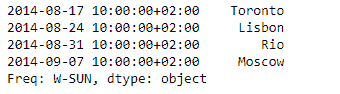
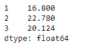

# 蟒蛇|熊猫系列. truncate()

> 原文:[https://www . geesforgeks . org/python-pandas-series-truncate/](https://www.geeksforgeeks.org/python-pandas-series-truncate/)

熊猫系列是带有轴标签的一维数组。标签不必是唯一的，但必须是可散列的类型。该对象支持基于整数和基于标签的索引，并提供了一系列方法来执行涉及索引的操作。

熊猫 `**Series.truncate()**`函数用于在某个索引值前后截断一个序列或数据帧。这是基于高于或低于特定阈值的索引值的布尔索引的一种有用的简写。

> **语法:**系列。截断(前=无，后=无，轴=无，复制=真)
> 
> **参数:**
> **前:**截断该索引值前的所有行。
> **之后:**截断该索引值之后的所有行。
> **轴:**轴要截断。默认情况下截断索引(行)。
> **副本:**返回截断部分的副本。
> 
> **返回:**截断的序列或数据帧。

**示例#1:** 使用`Series.truncate()`函数从给定日期之前的序列中截断一些数据。

```
# importing pandas as pd
import pandas as pd

# Creating the Series
sr = pd.Series(['New York', 'Chicago', 'Toronto', 'Lisbon', 'Rio', 'Moscow'])

# Create the Datetime Index
didx = pd.DatetimeIndex(start ='2014-08-01 10:00', freq ='W', 
                     periods = 6, tz = 'Europe/Berlin') 

# set the index
sr.index = didx

# Print the series
print(sr)
```

**输出:**


现在我们将使用`Series.truncate()`函数截断给定 Series 对象中“2014-08-17 10:00:00+02:00”之前的数据。

```
# truncate data prior to the given date
sr.truncate(before = '2014-08-17 10:00:00 + 02:00')
```

**输出:**



正如我们在输出中看到的那样，`Series.truncate()`函数已经成功截断了上述日期之前的所有数据。

**示例#2:** 使用`Series.truncate()`函数在给定索引标签之前和给定索引标签之后截断序列中的一些数据。

```
# importing pandas as pd
import pandas as pd

# Creating the Series
sr = pd.Series([19.5, 16.8, 22.78, 20.124, 18.1002])

# Print the series
print(sr)
```

**输出:**


现在我们将使用`Series.truncate()`函数来截断给定序列对象中第一个索引标签之前和第三个索引标签之后的数据。

```
# truncate data outside the given range
sr.truncate(before = 1, after = 3)
```

**输出:**



正如我们在输出中看到的，`Series.truncate()`函数已经成功地截断了所提到的索引标签之前和之后的所有数据。