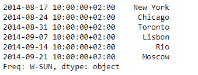
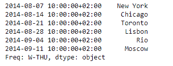

# 蟒蛇|熊猫系列. tshift()

> 原文:[https://www.geeksforgeeks.org/python-pandas-series-tshift/](https://www.geeksforgeeks.org/python-pandas-series-tshift/)

熊猫系列是带有轴标签的一维数组。标签不必是唯一的，但必须是可散列的类型。该对象支持基于整数和基于标签的索引，并提供了一系列方法来执行涉及索引的操作。

熊猫 `**Series.tshift()**`功能用于移动时间索引，使用索引的频率(如果有的话)。如果没有指定 freq，那么它会尝试使用索引的 freq 或 explicated _ freq 属性。如果这两个属性都不存在，将引发 ValueError。

> **语法:** Series.tshift(周期=1，频率=无，轴=0)
> 
> **参数:**
> **周期:**要移动的周期数，可以是正的也可以是负的
> **频率:**增量用于从时间序列模块或时间规则(例如‘EOM’)
> **轴:**对应于包含索引的轴
> 
> **返回:**移位:NDFrame

**示例#1:** 使用`Series.tshift()`函数将给定序列对象的基于 Datetime 的索引移动一定的周期。

```
# importing pandas as pd
import pandas as pd

# Creating the Series
sr = pd.Series(['New York', 'Chicago', 'Toronto', 'Lisbon', 'Rio', 'Moscow'])

# Create the Datetime Index
didx = pd.DatetimeIndex(start ='2014-08-01 10:00', freq ='W', 
                     periods = 6, tz = 'Europe/Berlin') 

# set the index
sr.index = didx

# Print the series
print(sr)
```

**输出:**


现在，我们将使用`Series.tshift()`功能，在序列对象已经应用的频率上，将索引移动 2 个周期。

```
# shift by 2 periods
sr.tshift(periods = 2)
```

**输出:**


正如我们在输出中看到的，`Series.tshift()`函数已经成功地将给定序列的基于日期时间的索引移动了 2 个周期。

**示例 2:** 使用`Series.tshift()`函数将给定序列对象的基于日期时间的索引增加一定的周期，并对其应用“每日”频率。

```
# importing pandas as pd
import pandas as pd

# Creating the Series
sr = pd.Series(['New York', 'Chicago', 'Toronto', 'Lisbon', 'Rio', 'Moscow'])

# Create the Datetime Index
didx = pd.DatetimeIndex(start ='2014-08-01 10:00', freq ='W', 
                     periods = 6, tz = 'Europe/Berlin') 

# set the index
sr.index = didx

# Print the series
print(sr)
```

**输出:**


现在我们将使用`Series.tshift()`函数，在序列对象已经应用的频率上，将索引增加 4 个周期。

```
# increment by 4 periods
sr.tshift(periods = 4, freq = 'D')
```

**输出:**



正如我们在输出中看到的那样，`Series.tshift()`函数已经成功地将给定序列的基于日期时间的索引增加了 4 个周期。