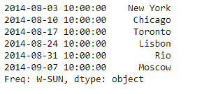
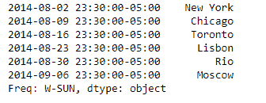
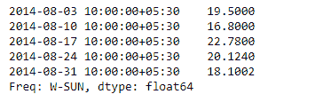
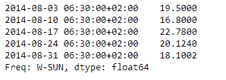

# Python | Pandas series . tz _ convert

> 原文:[https://www . geesforgeks . org/python-pandas-series-tz _ convert/](https://www.geeksforgeeks.org/python-pandas-series-tz_convert/)

Python 是进行数据分析的优秀语言，主要是因为以数据为中心的 python 包的奇妙生态系统。 ***【熊猫】*** 就是其中一个包，让导入和分析数据变得容易多了。

熊猫系列是带有轴标签的一维数组。标签不必是唯一的，但必须是可散列的类型。该对象支持基于整数和基于标签的索引，并提供了一系列方法来执行涉及索引的操作。

熊猫 `**Series.tz_convert()**`功能与时区感知索引一起工作。它将 tz 感知轴转换为目标时区。

> **语法:** Series.tz_convert(tz，轴=0，级别=无，复制=真)
> 
> **参数:**
> **tz :** 字符串或 pytz.timezone 对象
> **轴:**要转换的轴
> **级别:** int，str，默认 None
> **copy :** 还要制作底层数据的副本。
> 
> **返回:**系列

**示例#1:** 使用`Series.tz_convert()`功能将给定系列的时区感知指数转换为目标时区。

```
# importing pandas as pd
import pandas as pd

# Creating the Series
sr = pd.Series(['New York', 'Chicago', 'Toronto', 'Lisbon', 'Rio', 'Moscow'])

# Create the Datetime Index
didx = pd.DatetimeIndex(start ='2014-08-01 10:00', freq ='W', 
                           periods = 6, tz = 'Asia/Calcutta') 

# set the index
sr.index = didx

# Print the series
print(sr)
```

**输出:**


现在，我们将使用`Series.tz_convert()`功能将给定时区索引转换为时区感知索引，并转换为目标时区“美国/中部”。

```
# convert to 'US / Central'
sr.tz_convert('US/Central')
```

**输出:**

正如我们在输出中看到的，`Series.tz_convert()`函数已经将给定序列对象的索引的时区转换为所需的时区。

**示例 2:** 使用`Series.tz_convert()`功能将给定序列的时区感知索引转换为目标时区。

```
# importing pandas as pd
import pandas as pd

# Creating the Series
sr = pd.Series([19.5, 16.8, 22.78, 20.124, 18.1002])

# Create the Datetime Index
didx = pd.DatetimeIndex(start ='2014-08-01 10:00', freq ='W', 
                     periods = 5, tz = 'Asia/Calcutta') 

# set the index
sr.index = didx

# Print the series
print(sr)
```

**输出:**



现在，我们将使用`Series.tz_convert()`功能将给定时区索引转换为时区感知索引，并转换为目标时区“欧洲/柏林”

```
# convert to 'Europe / Berlin'
sr.tz_convert('Europe/Berlin')
```

**输出:**
