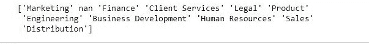

# 蟒蛇|熊猫系列.独特()

> 原文:[https://www.geeksforgeeks.org/python-pandas-series-unique/](https://www.geeksforgeeks.org/python-pandas-series-unique/)

Python 是进行数据分析的优秀语言，主要是因为以数据为中心的 Python 包的奇妙生态系统。 ***【熊猫】*** 就是其中一个包，让导入和分析数据变得容易多了。

在分析数据时，很多时候用户希望看到特定列中的唯一值，这可以使用 Pandas **`unique()`** 功能来完成。

要下载使用的 CSV 文件，点击这里[。](https://media.geeksforgeeks.org/wp-content/uploads/employees.csv)

> **语法:** Series.unique()
> 
> **返回类型:**该列中唯一值的 Numpy 数组

**示例#1:** 使用 Series.unique()
在此示例中，unique()方法用于知道 Team 列中所有类型的唯一值。

```
# importing pandas package
import pandas as pd

# making data frame from csv file
data = pd.read_csv("employees.csv")

# storing unique value in a variable
arr = data["Team"].unique()

# printing array
print(arr)
```

**输出:**
如输出图像所示，返回一个包含列中所有唯一值的数组。


**错误和异常:**

*   此方法仅适用于序列，不适用于数据帧
*   如输出所示，此方法包含空值作为唯一值。