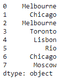
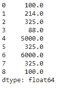

# Python |熊猫系列. update()

> 原文:[https://www.geeksforgeeks.org/python-pandas-series-update/](https://www.geeksforgeeks.org/python-pandas-series-update/)

Python 是进行数据分析的优秀语言，主要是因为以数据为中心的 python 包的奇妙生态系统。 ***【熊猫】*** 就是其中一个包，让导入和分析数据变得容易多了。

熊猫系列是带有轴标签的一维数组。标签不必是唯一的，但必须是可散列的类型。该对象支持基于整数和基于标签的索引，并提供了一系列方法来执行涉及索引的操作。

熊猫 `**Series.update()**`函数使用传递的序列对象中的非数值就地修改序列。该函数在索引上对齐。

> **语法:**系列.更新(其他)
> 
> **参数:**
> **其他:**系列
> 
> **返回:**无

**示例#1:** 使用`Series.update()`函数更新给定系列对象中一些城市的值

```
# importing pandas as pd
import pandas as pd

# Creating the Series
sr = pd.Series(['New York', 'Chicago', None, 'Toronto', 'Lisbon', 'Rio', 'Chicago', 'Lisbon'])

# Print the series
print(sr)
```

**输出:**


现在我们将使用`Series.update()`函数来更新在给定的 Series 对象中通过索引识别的值。

```
# update the values at the passed index
# from the values in the passed series object
sr.update(pd.Series(['Melbourne', 'Moscow'], index = [2, 7]))
```

**输出:**



正如我们在输出中看到的那样，`Series.update()`函数已经成功地从传递的序列对象中更新了原始序列对象中的值。

**示例 2:** 使用`Series.update()`函数更新给定序列对象中某些元素的值

```
# importing pandas as pd
import pandas as pd

# Creating the Series
sr = pd.Series([100, 214, 325, 88, None, 325, None, 325, 100])

# Print the series
print(sr)
```

**输出:**


现在我们将使用`Series.update()`函数来更新在给定的 Series 对象中通过索引识别的值。

```
# update the values at the passed index
# from the values in the passed series object
sr.update(pd.Series([5000, 6000], index = [4, 6]))
```

**输出:**

正如我们在输出中看到的，`Series.update()`函数已经成功地从传递的序列对象中更新了原始序列对象中的值。