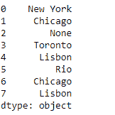
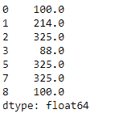

# 蟒蛇|熊猫系列. valid()

> 原文:[https://www.geeksforgeeks.org/python-pandas-series-valid/](https://www.geeksforgeeks.org/python-pandas-series-valid/)

Python 是进行数据分析的优秀语言，主要是因为以数据为中心的 python 包的奇妙生态系统。 ***【熊猫】*** 就是其中一个包，让导入和分析数据变得容易多了。

熊猫系列是带有轴标签的一维数组。标签不必是唯一的，但必须是可散列的类型。该对象支持基于整数和基于标签的索引，并提供了一系列方法来执行涉及索引的操作。

熊猫 `**Series.valid()**`函数返回相同的序列对象，但没有空值。

> **语法:** Series.valid(inplace=False，**kwargs)
> 
> **参数:**
> **在位:**布尔
> 
> **返回:**系列

**示例#1:** 使用`Series.valid()`函数从给定的序列对象中移除空值。

```
# importing pandas as pd
import pandas as pd

# Creating the Series
sr = pd.Series(['New York', 'Chicago', None, 'Toronto', 'Lisbon', 'Rio', 'Chicago', 'Lisbon'])

# Print the series
print(sr)
```

**输出:**



现在我们将使用`Series.valid()`函数从给定的序列对象中移除空值。

```
# return valid values
sr.valid()
```

**输出:**


正如我们在输出中看到的那样，`Series.valid()`函数返回了一个 series 对象，该对象包含调用它的原始 Series 对象的所有有效值。

**示例#2:** 使用`Series.valid()`函数从给定的序列对象中移除空值。

```
# importing pandas as pd
import pandas as pd

# Creating the Series
sr = pd.Series([100, 214, 325, 88, None, 325, None, 325, 100])

# Print the series
print(sr)
```

**输出:**


现在我们将使用`Series.valid()`函数从给定的序列对象中移除空值。

```
# return valid values
sr.valid()
```

**输出:**

正如我们在输出中看到的，`Series.valid()`函数返回了一个 series 对象，该对象包含了调用它的原始 Series 对象的所有有效值。