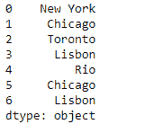
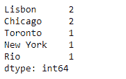
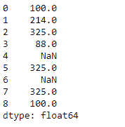
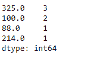

# Python | Pandas series . value _ counts()

> 原文:[https://www . geesforgeks . org/python-pandas-series-value _ counts/](https://www.geeksforgeeks.org/python-pandas-series-value_counts/)

Python 是进行数据分析的优秀语言，主要是因为以数据为中心的 python 包的奇妙生态系统。 ***【熊猫】*** 就是其中一个包，让导入和分析数据变得容易多了。

熊猫系列是带有轴标签的一维数组。标签不必是唯一的，但必须是可散列的类型。该对象支持基于整数和基于标签的索引，并提供了一系列方法来执行涉及索引的操作。

熊猫 `**Series.value_counts()**`函数返回一个包含唯一值计数的序列。结果对象将按降序排列，因此第一个元素是最常出现的元素。默认情况下不包括数值。

> **语法:**series . value _ counts(normalize =False，sort=True，升序= False，bins = None，dropna=True)
> 
> **参数:**
> **归一化:**如果为真，则返回的对象将包含唯一值的相对频率。
> **排序:**按值排序。
> **升序:**按升序排序。
> **面元:**与其统计数值，不如将它们分组到半开面元中，这是 pd.cut 的一个便利，只适用于数字数据。
> **dropna :** 不包括 NaN 的计数。
> 
> **返回:**计数:系列

**示例#1:** 使用`Series.value_counts()`函数查找给定序列对象中每个元素的唯一值计数。

```
# importing pandas as pd
import pandas as pd

# Creating the Series
sr = pd.Series(['New York', 'Chicago', 'Toronto', 'Lisbon', 'Rio', 'Chicago', 'Lisbon'])

# Print the series
print(sr)
```

**输出:**



现在我们将使用`Series.value_counts()`函数来查找给定 Series 对象中每个唯一值的值计数。

```
# find the value counts
sr.value_counts()
```

**输出:**



正如我们在输出中看到的那样，`Series.value_counts()`函数已经返回了给定 Series 对象中每个唯一值的值计数。

**示例#2:** 使用`Series.value_counts()`函数查找给定序列对象中每个元素的唯一值计数。

```
# importing pandas as pd
import pandas as pd

# Creating the Series
sr = pd.Series([100, 214, 325, 88, None, 325, None, 325, 100])

# Print the series
print(sr)
```

**输出:**



现在我们将使用`Series.value_counts()`函数来查找给定 Series 对象中每个唯一值的值计数。

```
# find the value counts
sr.value_counts()
```

**输出:**

正如我们在输出中看到的，`Series.value_counts()`函数已经返回了给定 Series 对象中每个唯一值的值计数。