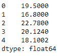
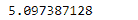
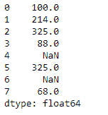
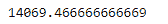

# 蟒蛇|熊猫系列. var

> 原文:[https://www.geeksforgeeks.org/python-pandas-series-var/](https://www.geeksforgeeks.org/python-pandas-series-var/)

Python 是进行数据分析的优秀语言，主要是因为以数据为中心的 python 包的奇妙生态系统。 ***【熊猫】*** 就是其中一个包，让导入和分析数据变得容易多了。

熊猫系列是带有轴标签的一维数组。标签不必是唯一的，但必须是可散列的类型。该对象支持基于整数和基于标签的索引，并提供了一系列方法来执行涉及索引的操作。

熊猫 `**Series.var()**`函数返回要求轴上的无偏方差。默认情况下，方差由 N-1 归一化。这可以使用 ddof 参数进行更改。

> **语法:** Series.var(axis=None，skipna=None，level=None，ddof=1，numeric_only=None，**kwargs)
> 
> **参数:**
> **轴:**{ index(0)}
> **skipna:**排除 NA/null 值。如果整行/整列是 NA，结果将是 NA
> **级别:**如果轴是多索引(分层)，沿特定级别计数，折叠成标量
> **ddof:**δ自由度。计算中使用的除数是 N–ddof，其中 N 代表元素的数量。
> **numeric_only :** 只包括 float、int、boolean 列。如果没有，将尝试使用所有内容，然后只使用数字数据。不适用于系列。
> 
> **返回:** var:标量或级数(如果指定了级别)

**示例#1:** 使用`Series.var()`函数找到给定序列对象的方差。

```
# importing pandas as pd
import pandas as pd

# Creating the Series
sr = pd.Series([19.5, 16.8, 22.78, 20.124, 18.1002])

# Print the series
print(sr)
```

**输出:**


现在我们用`Series.var()`函数求给定序列对象的方差。

```
# find the variance
sr.var()
```

**输出:**

正如我们在输出中看到的，`Series.var()`函数已经返回了给定 Series 对象的方差。

**例 2:** 用`Series.var()`函数求给定 Series 对象的方差。给定的 Series 对象包含一些缺失的值。

**注意:**我们可以通过将 skipna 参数设置为`True`来跳过缺失的值。

```
# importing pandas as pd
import pandas as pd

# Creating the Series
sr = pd.Series([100, 214, 325, 88, None, 325, None, 68])

# Print the series
print(sr)
```

**输出:**



现在我们用`Series.var()`函数求给定序列对象的方差。

```
# find the variance
sr.var(skipna = True)
```

**输出:**

正如我们在输出中看到的，`Series.var()`函数已经返回了给定 Series 对象的方差。