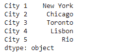
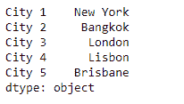
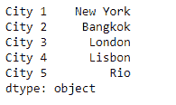
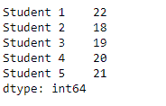
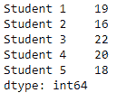
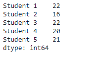

# 蟒蛇|熊猫系列

> 原文:[https://www.geeksforgeeks.org/python-pandas-series-where/](https://www.geeksforgeeks.org/python-pandas-series-where/)

Python 是进行数据分析的优秀语言，主要是因为以数据为中心的 python 包的奇妙生态系统。 ***【熊猫】*** 就是其中一个包，让导入和分析数据变得容易多了。

熊猫系列是带有轴标签的一维数组。标签不必是唯一的，但必须是可散列的类型。该对象支持基于整数和基于标签的索引，并提供了一系列方法来执行涉及索引的操作。

熊猫 `**Series.where()**`功能替换给定系列对象的输入条件为`False`的值。它将另一个对象作为输入，用于替换原始对象的值。

> **语法:** Series .其中(cond，other=nan，inplace=False，axis=None，level=None，errors='raise '，try_cast=False，raise_on_error=None)
> 
> **参数:**
> **秒:**布尔 ndfram、类数组或可调用
> **其他:**标量、ndfram 或可调用
> **在位:**布尔，默认 False
> **轴:** int，默认 None
> **级别:** int，默认 None
> **错误:** str，{ ' raise '，' ignore'}，默认 rail
> 
> **返回:** wh:与来电者类型相同

**示例#1:** 当传递的条件不满足时，使用`Series.where()`函数将给定序列对象中的值替换为其他值。

```
# importing pandas as pd
import pandas as pd

# Creating the First Series
sr1 = pd.Series(['New York', 'Chicago', 'Toronto', 'Lisbon', 'Rio'])

# Creating the row axis labels
sr1.index = ['City 1', 'City 2', 'City 3', 'City 4', 'City 5'] 

# Print the series
print(sr1)

# Creating the second Series
sr2 = pd.Series(['New York', 'Bangkok', 'London', 'Lisbon', 'Brisbane'])

# Creating the row axis labels
sr2.index = ['City 1', 'City 2', 'City 3', 'City 4', 'City 5']

# Print the series
print(sr2)
```

**输出:**


现在我们使用`Series.where()`函数替换那些不满足通过条件的值。

```
# replace the values
sr1.where(sr1 == 'Rio', sr2)
```

**输出:**

正如我们在输出中看到的，`Series.where()`功能已经替换了除了‘里约’城市以外的所有城市的名称。

**示例#2 :** 当传递的条件不满足时，使用`Series.where()`函数将给定 Series 对象中的值替换为其他值。

```
# importing pandas as pd
import pandas as pd

# Creating the First Series
sr1 = pd.Series([22, 18, 19, 20, 21])

# Creating the row axis labels
sr1.index = ['Student 1', 'Student 2', 'Student 3', 'Student 4', 'Student 5']

# Print the series
print(sr1)

# Creating the second Series
sr2 = pd.Series([19, 16, 22, 20, 18])

# Creating the row axis labels
sr2.index = ['Student 1', 'Student 2', 'Student 3', 'Student 4', 'Student 5']

# Print the series
print(sr2)
```

**输出:**



现在我们将使用`Series.where()`函数来替换那些不满足传递条件的值。

```
# replace the values
sr1.where(sr1 >20, sr2)
```

**输出:**

正如我们在输出中看到的，`Series.where()`函数已经替换了所有不满足通过条件的值。