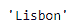
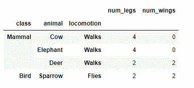
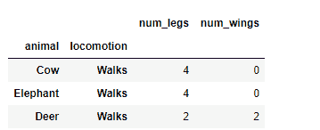

# 蟒蛇|熊猫系列. xs

> 原文:[https://www.geeksforgeeks.org/python-pandas-series-xs/](https://www.geeksforgeeks.org/python-pandas-series-xs/)

Python 是进行数据分析的优秀语言，主要是因为以数据为中心的 python 包的奇妙生态系统。 ***【熊猫】*** 就是其中一个包，让导入和分析数据变得容易多了。

熊猫系列是带有轴标签的一维数组。标签不必是唯一的，但必须是可散列的类型。该对象支持基于整数和基于标签的索引，并提供了一系列方法来执行涉及索引的操作。

熊猫 `**Series.xs()**`函数返回给定键值的系列/数据框的横截面。

> **语法:** Series.xs(键，轴=0，级别=无，drop _ level =真)
> 
> **参数:**
> **键:**标签包含在索引中，或者部分包含在多索引中。
> **轴:**轴检索横截面。
> **级别:**如果键部分包含在多索引中，请指出使用了哪些级别。级别可以通过标签或位置来引用。
> **drop_level :** 如果为 False，则返回与自身级别相同的对象。
> 
> **返回:**序列或数据帧

**示例#1:** 使用`Series.xs()`函数为传递的键值返回给定序列对象的横截面。

```
# importing pandas as pd
import pandas as pd

# Creating the Series
sr = pd.Series(['New York', 'Chicago', 'Toronto', 'Lisbon', 'Rio'])

# Creating the row axis labels
sr.index = ['City 1', 'City 2', 'City 3', 'City 4', 'City 5'] 

# Print the series
print(sr)
```

**输出:**

现在我们将使用`Series.xs()`函数返回给定系列对象的横截面。

```
# return cross-section corresponding to
# the 'City 4' label
sr.xs(key = 'City 4')
```

**输出:**

正如我们在输出中看到的，`Series.xs()`函数返回了‘里斯本’作为给定 Series 对象的横截面。

**示例 2 :** 使用`Dataframe.xs()`函数为传递的键值返回给定数据框对象的横截面。

```
# importing pandas as pd
import pandas as pd

# Creating the Dataframe
df = pd.DataFrame({'num_legs': [4, 4, 2, 2],
                  'num_wings': [0, 0, 2, 2],
                  'class': ['Mammal', 'Mammal', 'Mammal', 'Bird'],
                  'animal': ['Cow', 'Elephant', 'Deer', 'Sparrow'],
                  'locomotion': ['Walks', 'Walks', 'Walks', 'Flies']})

# setting the index
df = df.set_index(['class', 'animal', 'locomotion'])

# Print the Dataframe
print(df)
```

**输出:**


现在我们将使用`Dataframe.xs()`函数返回给定数据框对象的横截面。

```
# return cross-section corresponding to
# the 'Mammal' label
sr.xs(key = 'Mammal')
```

**输出:**

正如我们在输出中所看到的，`Dataframe.xs()`函数已经为传递的键值返回了给定 Dataframe 对象的横截面。