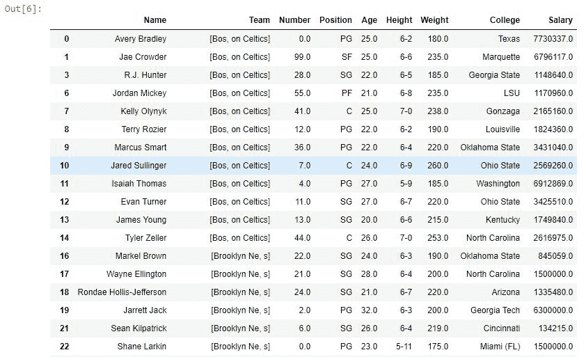
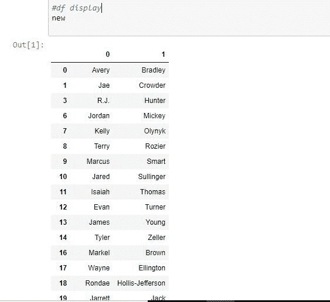
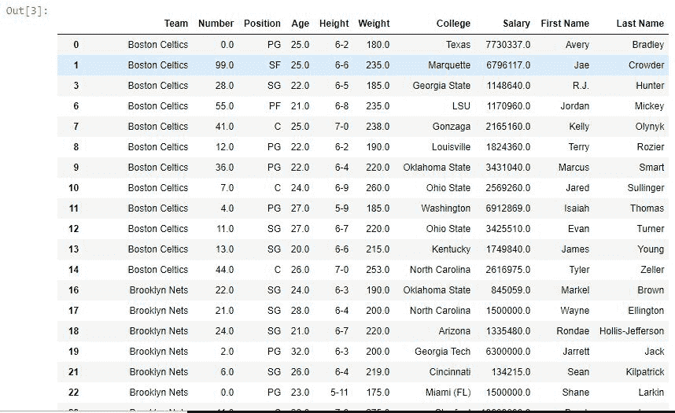

# Python | Pandas 使用 str.split()

将字符串拆分为两个 List/Columns

> 原文:[https://www . geesforgeks . org/python-pandas-split-string-in-two-list-columns-using-str-split/](https://www.geeksforgeeks.org/python-pandas-split-strings-into-two-list-columns-using-str-split/)

***【熊猫】*** 提供了一种围绕传递的分隔符/定界符拆分字符串的方法。之后，该字符串可以存储为序列中的列表，也可以用于从单个单独的字符串创建多个列数据框。

它的工作方式类似于 Python 默认的 [split()](https://www.geeksforgeeks.org/python-string-split/) 方法，但它只能应用于单个字符串。熊猫<代码**T9【str . split()**方法可以应用于整个系列。 ***。str*** 在每次调用这个方法之前都要加上前缀，以区别于 Python 的默认函数，否则会抛出一个错误。

> **语法:** Series.str.split(pat=None，n=-1，expand=False)
> 
> **参数:**
> 
> **pat:** 字符串值、分隔符或分隔字符串的分隔符。
> **n:** 单个字符串中最大分色数，默认值为-1，表示全部。
> **展开:**布尔值，如果为真，则返回不同列中不同值的数据框。否则它会返回一个包含字符串列表的序列。
> 
> **返回类型:**一系列列表或数据框，具体取决于展开参数

要下载代码中使用的 CSV，点击这里的[。](https://media.geeksforgeeks.org/wp-content/uploads/nba.csv)

在下面的例子中，使用的数据框包含了一些 NBA 球员的数据。任何操作前的数据框图像附在下面。


**示例#1:** 将字符串拆分为列表

在此数据中，拆分函数用于在每个“t”处拆分团队列。该参数设置为 1，因此单个字符串中的最大分色数将为 1。expand 参数为 False，这就是为什么返回一个包含字符串列表的序列，而不是数据框。

```py
# importing pandas module 
import pandas as pd

# reading csv file from url 
data = pd.read_csv("https://media.geeksforgeeks.org/wp-content/uploads/nba.csv")

# dropping null value columns to avoid errors
data.dropna(inplace = True)

# new data frame with split value columns
data["Team"]= data["Team"].str.split("t", n = 1, expand = True)

# df display
data
```

**输出:**
如输出图像所示，Team 列现在有一个列表。该字符串在第一次出现“t”时被分隔，而不是在第二次出现时被分隔，因为 n 参数被设置为 1(字符串中的最大分隔为 1)。


**例 2:** 用字符串制作单独的列

在本例中，“名称”列用空格(" ")分隔，expand 参数设置为 True，这意味着它将返回一个数据框，其中所有分隔的字符串都在不同的列中。然后使用数据框创建新列，并使用删除旧的名称列。drop()方法。

```py
# importing pandas module 
import pandas as pd

# reading csv file from url 
data = pd.read_csv("https://media.geeksforgeeks.org/wp-content/uploads/nba.csv")

# dropping null value columns to avoid errors
data.dropna(inplace = True)

# new data frame with split value columns
new = data["Name"].str.split(" ", n = 1, expand = True)

# making separate first name column from new data frame
data["First Name"]= new[0]

# making separate last name column from new data frame
data["Last Name"]= new[1]

# Dropping old Name columns
data.drop(columns =["Name"], inplace = True)

# df display
data
```

**输出:**
如输出图像所示，split()函数返回了一个新的数据框，它用于在数据框中创建新的两列(名字和姓氏)。

**新数据框**


**添加了列的数据框**
