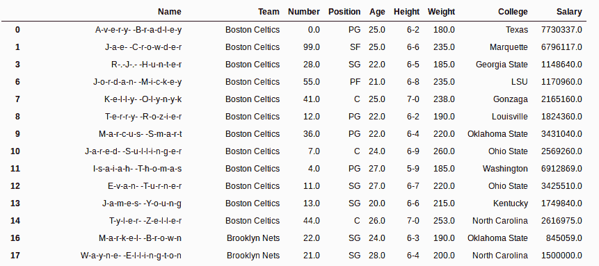
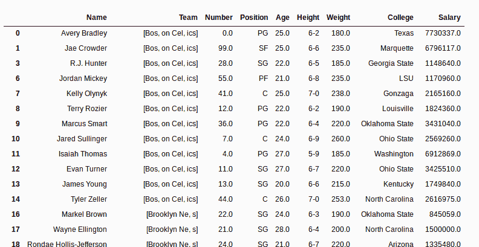
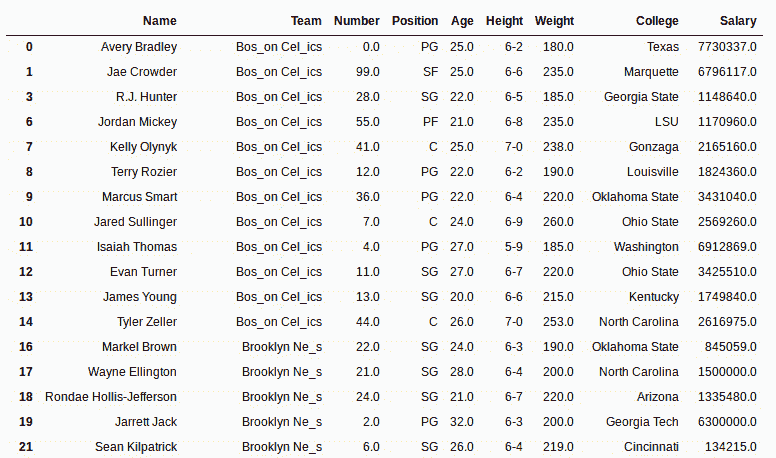

# Python | Pandas str.join()用传递的分隔符连接字符串/列表元素

> 原文:[https://www . geesforgeks . org/python-pandas-str-join-join-string-list-elements-with-passed-delimiter/](https://www.geeksforgeeks.org/python-pandas-str-join-to-join-string-list-elements-with-passed-delimiter/)

Python 是进行数据分析的优秀语言，主要是因为以数据为中心的 Python 包的奇妙生态系统。 ***【熊猫】*** 就是其中一个包，让导入和分析数据变得容易多了。

熊猫 **`str.join()`** 方法是用传递的分隔符将列表中的所有元素连接成一个序列。由于字符串也是字符数组(或字符列表)，因此当此方法应用于一系列字符串时，字符串在每个字符处与传递的分隔符连接。

***。str*** 在每次调用这个方法之前都必须加上前缀，以区别于 Python 的默认字符串方法。

> **语法:** Series.str.join(sep)
> 
> **参数:**
> **sep:** 字符串值，用它们之间的字符串连接元素
> 
> **返回类型:**带连接元素的系列

要下载使用的 Csv 文件，点击这里的[。](https://media.geeksforgeeks.org/wp-content/uploads/nba.csv)

在下面的例子中，使用的数据框包含了一些 NBA 球员的数据。任何操作前的数据框图像附在下面。


**示例#1:** 连接字符串元素

在本例中，str.join()方法用于“名称”列(字符串系列)。如前所述，字符串也是一个字符数组，因此字符串的每个字符都将使用 str.join()方法与传递的分隔符连接。

```py
# importing pandas module 
import pandas as pd

# reading csv file from url 
data = pd.read_csv("https://media.geeksforgeeks.org/wp-content/uploads/nba.csv")

# dropping null value columns to avoid errors
data.dropna(inplace = True)

# joining string and overwriting 
data["Name"]= data["Name"].str.join("-")

# display
data
```

**输出:**
如输出图像所示，名称列中的字符串已经用传递的分隔符进行了字符连接。


**示例 2:** 加入列表元素

在本例中，str.join()方法应用于一系列列表。使用 [str.split()](https://www.geeksforgeeks.org/python-pandas-split-strings-into-two-list-columns-using-str-split/) 方法将团队列中的数据分成列表。

```py
# importing pandas module 
import pandas as pd

# reading csv file from url 
data = pd.read_csv("https://media.geeksforgeeks.org/wp-content/uploads/nba.csv")

# dropping null value columns to avoid errors
data.dropna(inplace = True)

# splitting string and overwriting 
data["Team"]= data["Team"].str.split("t")

# joining with "_"
data["Team"]= data["Team"].str.join("_")

# display
data
```

**输出:**
如输出图像所示，使用 str.split()将数据拆分为列表，然后使用 str.join()将列表与分隔符“_”连接。

**拆分后的数据帧–**


**加入列表后的数据框–**
