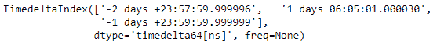
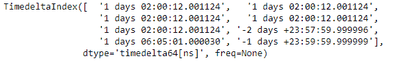
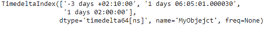
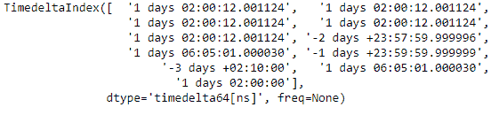

# Python |熊猫时间增量索引. append()

> 哎哎哎:# t0]https://www . geeksforgeeks . org/python-pandas-time delta index-append/

Python 是进行数据分析的优秀语言，主要是因为以数据为中心的 python 包的奇妙生态系统。 ***【熊猫】*** 就是其中一个包，让导入和分析数据变得容易多了。

熊猫 `**TimedeltaIndex.append()**`函数将一组索引选项附加在一起。通过将索引作为 python 列表或元组传递，一次可以追加多个索引对象。

> **语法:**时间增量索引.追加(其他)
> 
> **参数:**
> **其他:**索引或索引列表/元组
> 
> **返回:**追加:索引

**示例#1:** 使用`TimedeltaIndex.append()`函数在给定对象的末尾追加一个时间增量索引对象。

```
# importing pandas as pd
import pandas as pd

# Create the first TimedeltaIndex object
tidx1 = pd.TimedeltaIndex(start ='1 days 02:00:12.001124', periods = 5,
                                              freq ='N', name ='Koala')

# Create the second TimedeltaIndex object
tidx2 = pd.TimedeltaIndex(data =['-1 days 2 min 3us 10ns',
                                 '1 days 06:05:01.000030', 
                                 '-1 days + 23:59:59.999999'])

# Print the first TimedeltaIndex object
print(tidx1)

# Print the second TimedeltaIndex object
print(tidx2)
```

**输出:**



现在我们将在 tidx1 的末尾追加 tidx2。

```
# append tidx2 at the end of tidx1
tidx1.append(tidx2)
```

**输出:**

正如我们在输出中看到的，`TimedeltaIndex.append()`函数在 tidx1 的末尾追加了 tidx2。

**示例 2:** 使用`TimedeltaIndex.append()`函数在给定对象的末尾追加一个时间增量索引对象列表。

```
# importing pandas as pd
import pandas as pd

# Create the first TimedeltaIndex object
tidx1 = pd.TimedeltaIndex(start ='1 days 02:00:12.001124', periods = 5,
                                              freq ='N', name ='Koala')

# Create the second TimedeltaIndex object
tidx2 = pd.TimedeltaIndex(data =['-1 days 2 min 3us 10ns',
                                 '1 days 06:05:01.000030',
                                 '-1 days + 23:59:59.999999'])

# Create the third TimedeltaIndex object
tidx3 = pd.TimedeltaIndex(data =['-3 days 02:10:00',
                                 '1 days 06:05:01.000030',
                                 '1 days 02:00:00'], name ='MyObjejct')

# Print the first TimedeltaIndex object
print(tidx1)

# Print the second TimedeltaIndex object
print(tidx2)

# Print the third TimedeltaIndex object
print(tidx3)
```

**输出:**




现在我们将在 tidx1 的末尾追加 tidx2 和 tidx3。

```
# append tidx2 and tidx3 at the end of tidx1
tidx1.append([tidx2, tidx3])
```

**输出:**

在输出中我们可以看到，`TimedeltaIndex.append()`函数在 tidx1 的末尾追加了 tidx2 和 tidx3。