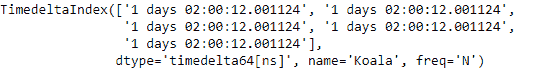
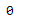
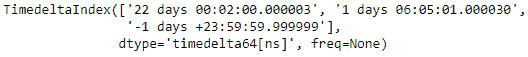
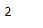

# Python |熊猫时间差指数。argmin

> 哎哎哎:# t0]https://www . geeksforgeeks . org/python 熊猫-timedeltaindex-argmin/

Python 是进行数据分析的优秀语言，主要是因为以数据为中心的 python 包的奇妙生态系统。 ***【熊猫】*** 就是其中一个包，让导入和分析数据变得容易多了。

熊猫 `**TimedeltaIndex.argmin()**`函数返回沿时间增量索引对象中一个轴的最小值的索引。功能类似`numpy.ndarray.argmin`。

> **语法:**time delta index . argmin(axis = none、*args、**kwargs)
> 
> **参数:**
> **轴:**无
> 
> **返回:**整数索引值

**示例#1:** 使用`TimedeltaIndex.argmin()`函数查找给定时间增量索引对象中最小值的索引。

```py
# importing pandas as pd
import pandas as pd

# Create the first TimedeltaIndex object
tidx = pd.TimedeltaIndex(start ='1 days 02:00:12.001124', periods = 5,
                                             freq ='N', name ='Koala')

# Print the TimedeltaIndex object
print(tidx)
```

**输出:**


现在我们打印 *tidx* 对象中最小值的索引。

```py
# return the index of minimum value.
tidx.argmin()
```

**输出:**

正如我们在输出中看到的，`TimedeltaIndex.argmin()`函数的值为 0，表示 tidx 对象中的最小值出现在第 0 个索引处。

**示例#2:** 使用`TimedeltaIndex.argmin()`函数查找给定时间增量索引对象中最小值的索引。

```py
# importing pandas as pd
import pandas as pd

# Create the TimedeltaIndex object
tidx = pd.TimedeltaIndex(data =['22 days 2 min 3us 10ns',
                                '1 days 06:05:01.000030', 
                                '-1 days + 23:59:59.999999'])

# Print the TimedeltaIndex object
print(tidx)
```

**输出:**


现在我们打印 *tidx* 对象中最小值的索引。

```py
# return the index of minimum value.
tidx.argmin()
```

**输出:**

正如我们在输出中看到的，`TimedeltaIndex.argmin()`函数有 2，表示 tidx 对象中的最小值出现在第 2 个索引处。