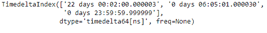
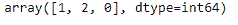
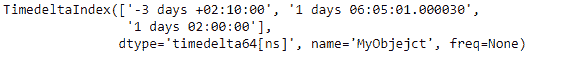
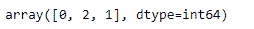

# Python |熊猫时间差指数. argsort

> 哎哎哎:# t0]https://www . geeksforgeeks . org/python 熊猫-timedeltaindex-argsort/

Python 是进行数据分析的优秀语言，主要是因为以数据为中心的 python 包的奇妙生态系统。 ***【熊猫】*** 就是其中一个包，让导入和分析数据变得容易多了。

熊猫 `**TimedeltaIndex.argsort()**`函数返回对索引及其底层数据进行排序的索引。默认情况下，顺序是非递减的。

> **语法:**time delta index . argsort(* args、**kwargs)
> 
> **参数:**无
> 
> **返回:**索引数组

**示例#1:** 使用`TimedeltaIndex.argsort()`函数查找给定时间增量索引对象的元素顺序，该对象将对对象中的基础数据进行排序。

```py
# importing pandas as pd
import pandas as pd

# Create the first TimedeltaIndex object
tidx = pd.TimedeltaIndex(data =['22 day 2 min 3us 10ns',
                                '06:05:01.000030', 
                                '+23:59:59.999999'])

# Print the TimedeltaIndex object
print(tidx)
```

**输出:**


现在我们将找到元素的顺序，这些元素将对 tidx 对象中的底层数据进行排序。

```py
# return the ordering of indices
# which will sort the data
tidx.argsort()
```

**输出:**

正如我们在输出中看到的，`TimedeltaIndex.argsort()`函数返回了一个包含索引值的数组，该数组将对 tidx 对象的底层数据进行排序。

**示例 2:** 使用`TimedeltaIndex.argsort()`函数查找给定时间增量索引对象的元素顺序，该对象将对对象中的基础数据进行排序。

```py
# importing pandas as pd
import pandas as pd

# Create the TimedeltaIndex object
tidx = pd.TimedeltaIndex(data =['-3 days 02:10:00', 
                                '1 days 06:05:01.000030', 
                                '1 days 02:00:00'], name ='MyObjejct')

# Print the TimedeltaIndex object
print(tidx)
```

**输出:**


现在我们将找到元素的顺序，这些元素将对 tidx 对象中的底层数据进行排序。

```py
# return the ordering of indices 
# which will sort the data
tidx.argsort()
```

**输出:**

正如我们在输出中看到的，`TimedeltaIndex.argsort()`函数返回了一个包含索引值的数组，该数组将对 tidx 对象的底层数据进行排序。