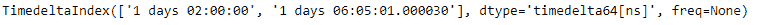
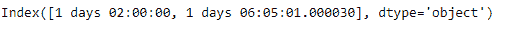
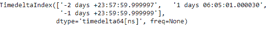
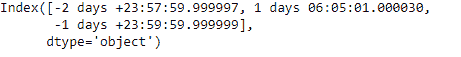

# python \ panda 时标索引. asobject

> 哎哎哎:# t0]https://www . geeksforgeeks . org/python-pandas-time delta index-as object/

Python 是进行数据分析的优秀语言，主要是因为以数据为中心的 python 包的奇妙生态系统。 ***【熊猫】*** 就是其中一个包，让导入和分析数据变得容易多了。

熊猫 `**TimedeltaIndex.asobject**`属性返回包含装箱值的对象索引。返回索引的数据类型为`object`。

> **语法:t1】timedeletendex . asobject**
> 
> **返回:**指数

**示例#1:** 使用`TimedeltaIndex.asobject`属性将时间增量索引对象转换为索引。

```py
# importing pandas as pd
import pandas as pd

# Create the TimedeltaIndex object
tidx = pd.TimedeltaIndex(data =['1 days 02:00:00', 
                                '1 days 06:05:01.000030'])

# Print the TimedeltaIndex
print(tidx)
```

**输出:**

现在我们要把 TimedeltaIndex 对象转换成 Index 对象。

```py
# convert to object values.
tidx.asobject
```

**输出:**

正如我们在输出中看到的，`TimedeltaIndex.asobject`属性已经将 TimedeltaIndex 对象转换为 Index。

**示例#2:** 使用`TimedeltaIndex.asobject`属性将时间增量索引对象转换为索引。

```py
# importing pandas as pd
import pandas as pd

# Create the TimedeltaIndex object
tidx = pd.TimedeltaIndex(data =['-1 days 2 min 3us', '1 days 06:05:01.000030',
                                                 '-1 days + 23:59:59.999999'])

# Print the TimedeltaIndex
print(tidx)
```

**输出:**


现在我们想要将时间增量索引对象转换成索引对象。

```py
# convert to object values.
tidx.asobject
```

**输出:**

正如我们在输出中看到的，`TimedeltaIndex.asobject`属性已经将 TimedeltaIndex 对象转换为 Index。