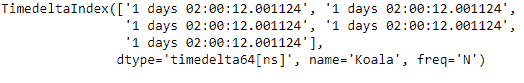
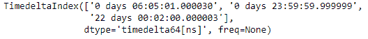
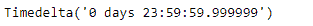

# Python |熊猫时间差指数. ASF

> 哎哎哎:# t0]https://www . geeksforgeeks . org/python-pandas-time delta index-ASF/

Python 是进行数据分析的优秀语言，主要是因为以数据为中心的 python 包的奇妙生态系统。 ***【熊猫】*** 就是其中一个包，让导入和分析数据变得容易多了。

pandas**time delta index . asof()**函数在排序索引上工作，它返回最新的标签，直到并包括传递的标签。如果没有找到传递的标签，函数返回 NaN。

> **语法:** TimedeltaIndex.asof(标签)
> **参数:**
> **标签:**标签
> **返回:** Timedelta 对象

**示例#1:** 使用 TimedeltaIndex.asof()函数查找给定 TimedeltaIndex 对象的传递标签之前的最新标签。

## 蟒蛇 3

```
# importing pandas as pd
import pandas as pd

# Create the first TimedeltaIndex object
tidx = pd.TimedeltaIndex(start ='1 days 02:00:12.001124', periods = 5,
                                            freq ='N', name ='Koala')

# Print the TimedeltaIndex object
print(tidx)
```

**输出:**



现在，我们将使用 TimedeltaIndex.asof()函数来查找 tidx 对象中最近的标签为“1 days 02:00:12.001134”。

## 蟒蛇 3

```
# return the most recent label
tidx.asof('1 days 02:00:12.001134')
```

**输出:**


正如我们在输出中看到的，TimedeltaIndex.asof()函数返回了一个值，该值是传递的标签之前的最新值。

**示例#2:** 使用 TimedeltaIndex.asof()函数查找给定 TimedeltaIndex 对象的元素顺序，该对象将对对象中的底层数据进行排序。

## 蟒蛇 3

```
# importing pandas as pd
import pandas as pd

# Create the TimedeltaIndex object
tidx = pd.TimedeltaIndex(data =['06:05:01.000030',
                                '+23:59:59.999999',
                                '22 day 2 min 3us 10ns'])

# Print the TimedeltaIndex object
print(tidx)
```

**输出:**



现在我们将使用 TimedeltaIndex.asof()函数来查找 tidx 对象中最近的标签到'+23:59:59.999999 '。

## 蟒蛇 3

```
# return the most recent label
tidx.asof('+23:59:59.999999')
```

**输出:**



正如我们在输出中看到的，TimedeltaIndex.asof()函数返回了一个值，该值是传递的标签之前的最新值。