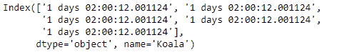
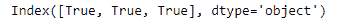

# python | pandas time delta index . asttype()

> 哎哎哎:# t0]https://www . geeksforgeeks . org/python-pandas-time delta index-asttype/

Python 是进行数据分析的优秀语言，主要是因为以数据为中心的 python 包的奇妙生态系统。 ***【熊猫】*** 就是其中一个包，让导入和分析数据变得容易多了。

熊猫 `**TimedeltaIndex.astype()**`函数创建一个带有转换为数据类型的值的索引。新索引的类别由数据类型决定。当无法转换时，会引发 ValueError 异常。

> **语法:**时间增量索引. a 类型(数据类型，副本=真)
> 
> **参数:**
> **数据类型:** numpy 数据类型或 pandas 类型
> **副本:** bool，默认 True
> 默认情况下，as type 总是返回一个新分配的对象。如果副本设置为假，并且满足数据类型的内部要求，则使用原始数据创建新索引，或者返回原始索引。
> 
> **返回:**索引对象

**示例#1:** 使用`TimedeltaIndex.astype()`函数将时间增量索引对象的值转换为“字符串”。

```
# importing pandas as pd
import pandas as pd

# Create the first TimedeltaIndex object
tidx = pd.TimedeltaIndex(start = '1 days 02:00:12.001124',
                       periods = 5, freq = 'N', name = 'Koala')

# Print the TimedeltaIndex object
print(tidx)
```

**输出:**


现在我们将使用`TimedeltaIndex.astype()`函数将该值转换为字符串。

```
# cast the data values to string format.
tidx.astype('str')
```

**输出:**



正如我们在输出中看到的那样，`TimedeltaIndex.astype()`函数已经将 tidx 对象的值转换为所需的格式。

**示例 2:** 使用`TimedeltaIndex.astype()`函数将时间增量索引对象的值转换为“布尔”。

```
# importing pandas as pd
import pandas as pd

# Create the TimedeltaIndex object
tidx = pd.TimedeltaIndex(data = ['06:05:01.000030', '+23:59:59.999999',
                                              '22 day 2 min 3us 10ns'])

# Print the TimedeltaIndex object
print(tidx)
```

**输出:**


现在我们将使用`TimedeltaIndex.astype()`函数将该值转换为布尔类型。

```
# cast the data values to bool type.
tidx.astype('bool')
```

**输出:**



正如我们在输出中看到的那样，`TimedeltaIndex.astype()`函数已经将 tidx 对象的值转换为所需的格式。