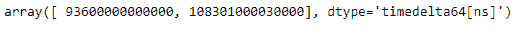
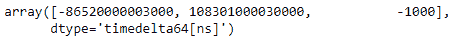

# Python |熊猫时间差指数. base

> 哎哎哎:# t0]https://www . geeksforgeeks . org/python 熊猫时间增量指数基/

Python 是进行数据分析的优秀语言，主要是因为以数据为中心的 python 包的奇妙生态系统。 ***【熊猫】*** 就是其中一个包，让导入和分析数据变得容易多了。

如果基础数据的内存被多个对象共享，Pandas `**TimedeltaIndex.base**`属性返回基础对象。

> **语法:t1】timedeletendex . base**
> 
> **返回:**数组

**示例#1:** 使用`TimedeltaIndex.base`属性找出时间增量索引对象的基址。

```py
# importing pandas as pd
import pandas as pd

# Create the TimedeltaIndex object
tidx = pd.TimedeltaIndex(data =['1 days 02:00:00', '1 days 06:05:01.000030'])

# Print the TimedeltaIndex
print(tidx)

# Create a copy
tidx_copy = tidx
```

**输出:**


现在我们想找出这两个对象的基址

```py
# Print the base address of original object
tidx.base

# Print the base address of the copied object
tidx_copy.base
```

**输出:**


正如我们在输出中看到的，`TimedeltaIndex.base`属性为两个对象返回了相同的基址。

**示例#2:** 使用`TimedeltaIndex.base`属性找出 TimedeltaIndex 对象的基址。

```py
# importing pandas as pd
import pandas as pd

# Create the TimedeltaIndex object
tidx = pd.TimedeltaIndex(data =['-1 days 2 min 3us', '1 days 06:05:01.000030',
                                                 '-1 days + 23:59:59.999999'])

# Print the TimedeltaIndex
print(tidx)

# Create a copy
tidx_copy = tidx
```

**输出:**


现在我们想找出这两个对象的基址

```py
# Print the base address of original object
tidx.base

# Print the base address of the copied object
tidx_copy.base
```

**输出:**


正如我们在输出中看到的，`TimedeltaIndex.base`属性为两个对象返回了相同的基址。