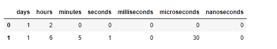
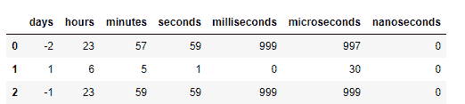

# Python | Pandas time delta index . components

> 原文:[https://www . geesforgeks . org/python-pandas-time deltaindex-components/](https://www.geeksforgeeks.org/python-pandas-timedeltaindex-components/)

Python 是进行数据分析的优秀语言，主要是因为以数据为中心的 python 包的奇妙生态系统。 ***【熊猫】*** 就是其中一个包，让导入和分析数据变得容易多了。

Pandas `**TimedeltaIndex.components**`属性返回时间增量的组成部分(天、小时、分钟、秒、毫秒、微秒、纳秒)的数据帧。

> **语法:**时间增量索引。组件
> 
> **返回:**一个数据帧

**示例#1:** 使用`TimedeltaIndex.components`属性返回时间增量组件的数据帧。

```py
# importing pandas as pd
import pandas as pd

# Create the TimedeltaIndex object
tidx = pd.TimedeltaIndex(data =['1 days 02:00:00', 
                                '1 days 06:05:01.000030'])

# Print the TimedeltaIndex
print(tidx)
```

**输出:**


现在我们想要返回 tidx 对象组件的数据帧。

```py
# return a dataframe constructed from
# the components of the Timedelta
tidx.components
```

**输出:**

正如我们在输出中看到的，`TimedeltaIndex.components`属性返回了一个由时间增量的组件构成的数据帧

**示例 2:** 使用`TimedeltaIndex.components`属性返回时间增量的组件的数据帧。

```py
# importing pandas as pd
import pandas as pd

# Create the TimedeltaIndex object
tidx = pd.TimedeltaIndex(data =['-1 days 2 min 3us', '1 days 06:05:01.000030',
                                                 '-1 days + 23:59:59.999999'])

# Print the TimedeltaIndex
print(tidx)
```

**输出:**


现在我们想要返回 tidx 对象组件的数据帧。

```py
# return a dataframe constructed from
# the components of the Timedelta
tidx.components
```

**输出:**

正如我们在输出中看到的那样，`TimedeltaIndex.components`属性返回了一个由时间增量组件构建的数据帧