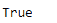

# Python | Pandas time deltaindex . contains

> 原文:[https://www . geesforgeks . org/python-pandas-time deltaindex-contains/](https://www.geeksforgeeks.org/python-pandas-timedeltaindex-contains/)

Python 是进行数据分析的优秀语言，主要是因为以数据为中心的 python 包的奇妙生态系统。 ***【熊猫】*** 就是其中一个包，让导入和分析数据变得容易多了。

熊猫**时间增量索引. contains()** 函数检查传递的标签是否存在于时间增量索引对象中。它返回一个布尔值。如果传递的标签存在，则返回真或假。

> **语法:**time delta index . contains(key)
> **参数:**
> **key:**object
> **Return:**boolean

**示例#1:** 使用 TimedeltaIndex.contains()函数检查传递的标签是否存在于索引中。

## 蟒蛇 3

```py
# importing pandas as pd
import pandas as pd

# Create the first TimedeltaIndex object
tidx = pd.TimedeltaIndex(start ='1 days 02:00:12.001124', periods = 5,
                                            freq ='N', name ='Koala')

# Print the TimedeltaIndex object
print(tidx)
```

**输出:**


现在我们将使用 TimedeltaIndex.contains()函数来检查 tidx 对象中是否存在“1 days 02:00:12.001124”。

## 蟒蛇 3

```py
# check if the passed label is present or not.
tidx.contains('1 days 02:00:12.001124')
```

**输出:**



正如我们在输出中看到的，TimedeltaIndex.contains()函数返回了 True，表示传递的标签存在于索引中。

**示例 2:** 使用 TimedeltaIndex.contains()函数检查传递的标签是否存在于索引中。

## 蟒蛇 3

```py
# importing pandas as pd
import pandas as pd

# Create the TimedeltaIndex object
tidx = pd.TimedeltaIndex(data =['06:05:01.000030', '+23:59:59.999999',
                                       '22 day 2 min 3us 10ns', None])

# Print the TimedeltaIndex object
print(tidx)
```

**输出:**


现在我们将使用 TimedeltaIndex.contains()函数来检查 tidx 对象中是否存在“1 days 02:00:12.0101124”。

## 蟒蛇 3

```py
# check if the passed label is present or not.
tidx.contains('1 days 02:00:12.0101124')
```

**输出:**


正如我们在输出中看到的，TimedeltaIndex.contains()函数返回了 False，表示传递的标签不在索引中。