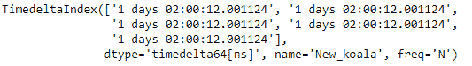
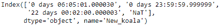

# Python |熊猫时间差指数. copy

> 哎哎哎:# t0]https://www . geeksforgeeks . org/python 熊猫-timedeltaindex-copy/

Python 是进行数据分析的优秀语言，主要是因为以数据为中心的 python 包的奇妙生态系统。 ***【熊猫】*** 就是其中一个包，让导入和分析数据变得容易多了。

熊猫 `**TimedeltaIndex.copy()**`函数复制这个时间增量索引对象。该函数还设置新对象的名称和数据类型属性

> **语法:** TimedeltaIndex.copy(名称=无，深度=假，数据类型=无，**kwargs)
> 
> **参数:**
> **名称:**字符串，可选
> **深:**布尔，默认 False
> **数据类型:** numpy 数据类型或 pandas 数据类型
> 
> **返回:**副本:索引

**示例#1:** 使用`TimedeltaIndex.copy()`函数复制给定的时间增量索引对象。

```py
# importing pandas as pd
import pandas as pd

# Create the first TimedeltaIndex object
tidx = pd.TimedeltaIndex(start ='1 days 02:00:12.001124', periods = 5,
                                            freq ='N', name ='Koala')

# Print the TimedeltaIndex object
print(tidx)
```

**输出:**


现在我们将使用`TimedeltaIndex.copy()`函数来复制 tidx 对象，并将复制对象的名称设置为“New_koala”。

```py
# make a copy and set the name
tidx_copy = tidx.copy(name ='New_koala')

# print the new object
print(tidx_copy)
```

**输出:**

在输出中我们可以看到，`TimedeltaIndex.copy()`函数已经复制了对象，并且该函数还设置了名称。

**示例 2:** 使用`TimedeltaIndex.copy()`功能检查通过的标签是否出现在索引中。

```py
# importing pandas as pd
import pandas as pd

# Create the TimedeltaIndex object
tidx = pd.TimedeltaIndex(data =['06:05:01.000030', '+23:59:59.999999',
                                       '22 day 2 min 3us 10ns', None])

# Print the TimedeltaIndex object
print(tidx)
```

**输出:**


现在我们将使用`TimedeltaIndex.copy()`函数来复制 tidx 对象，并将复制对象的名称设置为“New_koala”。我们还将把对象的数据类型改为字符串。

```py
# make a copy, set the name and change the dtype
tidx_copy = tidx.copy(dtype ='str', name ='New_koala')

# print the new object
print(tidx_copy)
```

**输出:**

正如我们在输出中看到的，`TimedeltaIndex.copy()`函数已经复制了对象，并且还注意到了新对象的数据类型。