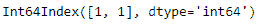
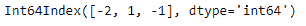

# Python |熊猫时间差指数. days

> 哎哎哎:# t0]https://www . geeksforgeeks . org/python 熊猫时间增量指数天数/

Python 是进行数据分析的优秀语言，主要是因为以数据为中心的 python 包的奇妙生态系统。 ***【熊猫】*** 就是其中一个包，让导入和分析数据变得容易多了。

熊猫 `**TimedeltaIndex.days**`属性返回时间增量索引对象中每个元素的天数。它返回一个索引对象。

> **语法:T1】时时刻刻索引. days**
> 
> **返回:**指数

**示例#1:** 使用`TimedeltaIndex.days`属性返回时间增量索引对象的每个条目中的天数。

```
# importing pandas as pd
import pandas as pd

# Create the TimedeltaIndex object
tidx = pd.TimedeltaIndex(data =['1 days 02:00:00', 
                        '1 days 06:05:01.000030'])

# Print the TimedeltaIndex
print(tidx)
```

**输出:**


现在我们想要返回 tidx 对象的每个条目的天数。

```
# return the number of days
tidx.days
```

**输出:**

正如我们在输出中看到的，`TimedeltaIndex.days`属性返回了一个 Index 对象，该对象包含 TimedeltaIndex 对象中每个条目的天数。

**示例 2:** 使用`TimedeltaIndex.days`属性返回 TimedeltaIndex 对象每个条目中的天数。

```
# importing pandas as pd
import pandas as pd

# Create the TimedeltaIndex object
tidx = pd.TimedeltaIndex(data =['-1 days 2 min 3us', '1 days 06:05:01.000030', 
                                                '-1 days + 23:59:59.999999'])

# Print the TimedeltaIndex
print(tidx)
```

**输出:**


现在我们想要返回 tidx 对象的每个条目的天数。

```
# return the number of days
tidx.days
```

**输出:**

正如我们在输出中看到的，`TimedeltaIndex.days`属性返回了一个 Index 对象，其中包含 TimedeltaIndex 对象中每个条目的天数。