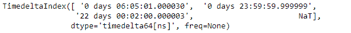
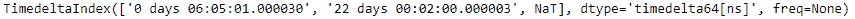
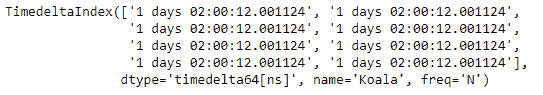

# python \ panda 时标索引. delete

> 原文:[https://www . geesforgeks . org/python-pandas-time deltaindex-delete/](https://www.geeksforgeeks.org/python-pandas-timedeltaindex-delete/)

Python 是进行数据分析的优秀语言，主要是因为以数据为中心的 python 包的奇妙生态系统。 ***【熊猫】*** 就是其中一个包，让导入和分析数据变得容易多了。

熊猫 `**TimedeltaIndex.delete()**`函数创建一个新的日期时间索引，删除传递的位置。该功能可以一次删除多个位置。它以要删除的标签的索引为参数。

> **语法:**时间增量索引.删除(loc)
> 
> **参数:**
> **loc :** 指示要移除哪些子阵列。
> 
> **返回:** new_index : TimedeltaIndex

**示例#1:** 使用`TimedeltaIndex.delete()`函数从时间增量索引对象中删除传递的索引。

```py
# importing pandas as pd
import pandas as pd

# Create the TimedeltaIndex object
tidx = pd.TimedeltaIndex(data =['06:05:01.000030', '+23:59:59.999999',
                                       '22 day 2 min 3us 10ns', None])

# Print the TimedeltaIndex object
print(tidx)
```

**输出:**


现在我们将使用`TimedeltaIndex.delete()`函数删除第一个索引处的值。

**注:**指数值从 0 开始。

```py
# delete the passed index
tidx.delete(1)
```

**输出:**

正如我们在输出中看到的，`TimedeltaIndex.delete()`函数已经删除了传递的索引并返回了一个新的对象。

**示例 2:** 使用`TimedeltaIndex.delete()`函数从 TimedeltaIndex 对象中删除传递的索引。

```py
# importing pandas as pd
import pandas as pd

# Create the first TimedeltaIndex object
tidx = pd.TimedeltaIndex(start ='1 days 02:00:12.001124', periods = 8,
                                             freq ='N', name ='Koala')

# Print the TimedeltaIndex object
print(tidx)
```

**输出:**


现在我们将使用`TimedeltaIndex.delete()`函数删除传递的索引处的值。

**注:**指数值从 0 开始。

```py
# delete the passed indexes
tidx.delete([2, 3, 4])
```

**输出:**

正如我们在输出中看到的，`TimedeltaIndex.delete()`函数已经删除了传递的索引，并返回了一个新的对象。