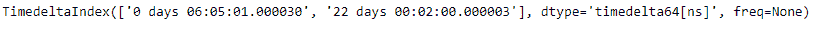
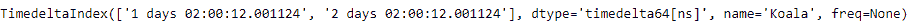

# 蟒蛇|熊猫 TimedeltaIndex.difference

> 原文:[https://www . geesforgeks . org/python-pandas-time delta index-difference/](https://www.geeksforgeeks.org/python-pandas-timedeltaindex-difference/)

Python 是进行数据分析的优秀语言，主要是因为以数据为中心的 python 包的奇妙生态系统。 ***【熊猫】*** 就是其中一个包，让导入和分析数据变得容易多了。
Pandas**time delta Index . difference()**函数返回一个新的索引，其中包含索引中不在其他索引中的元素。这是两个索引对象的集合差。如果排序是可能的，它将被排序。

> **语法:** TimedeltaIndex.difference(其他)
> **参数:**
> **其他:** Index 或数组状
> **Return:**difference:Index

**示例#1:** 使用 TimedeltaIndex.difference()函数查找两个 TimedeltaIndex 对象的集合差。

## 蟒蛇 3

```
# importing pandas as pd
import pandas as pd

# Create the first TimedeltaIndex object
tidx1 = pd.TimedeltaIndex(data =['06:05:01.000030', '+23:59:59.999999',
                                 '22 day 2 min 3us 10ns', '+23:29:59.999999',
                                                         '+12:19:59.999999'])

# Create the second TimedeltaIndex object
tidx2 = pd.TimedeltaIndex(data =['09:11:18.000030', '+23:59:59.999999',
                                 '9 day 18 min 3us ', '+23:29:59.999999',
                                                     '+12:19:59.999999'])

# Print the first and second TimedeltaIndex object
print(tidx1, "\n", tidx2)
```

**输出:**


现在我们将使用 TimedeltaIndex.difference()函数来找到集合差。

## 蟒蛇 3

```
# find the set difference
tidx1.difference(tidx2)
```

**输出:**



正如我们在输出中看到的，TimedeltaIndex.difference()函数返回了一个新的对象，该对象只包含 tidx1 独有的元素。

**例 2:** 使用 TimedeltaIndex.difference()函数求两个 TimedeltaIndex 对象的集合差。

## 蟒蛇 3

```
# importing pandas as pd
import pandas as pd

# Create the first TimedeltaIndex object
tidx1 = pd.TimedeltaIndex(start ='1 days 02:00:12.001124', periods = 5,
                                              freq ='D', name ='Koala')

# Create the second TimedeltaIndex object
tidx2 = pd.TimedeltaIndex(start ='3 days 02:00:12.001124', periods = 5,
                                              freq ='D', name ='Koala')

# Print the first and second TimedeltaIndex object
print(tidx1, "\n", tidx2)
```

**输出:**


现在我们将使用 TimedeltaIndex.difference()函数来找到集合差。

## 蟒蛇 3

```
# find the set difference
tidx1.difference(tidx2)
```

**输出:**



正如我们在输出中看到的，TimedeltaIndex.difference()函数返回了一个新的对象，该对象只包含 tidx1 独有的元素。