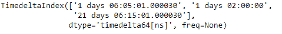

# Python | Pandas time delta index . drop _ duplicates

> 原文:[https://www . geesforgeks . org/python-pandas-time delta index-drop _ duplicates/](https://www.geeksforgeeks.org/python-pandas-timedeltaindex-drop_duplicates/)

Python 是进行数据分析的优秀语言，主要是因为以数据为中心的 python 包的奇妙生态系统。 ***【熊猫】*** 就是其中一个包，让导入和分析数据变得容易多了。

熊猫 `**TimedeltaIndex.drop_duplicates()**`函数返回删除了重复值的索引。该函数提供了选择保留哪个重复值和删除哪个剩余值的灵活性。

> **语法:**time delta index . drop _ duplicates(keep = ' first ')
> 
> **参数:**
> **保留:** { '第一个'，'最后一个'，False}，默认'第一个'
> **- >** 第一个:除去第一个出现的重复项。
> **- >** 最后:除去最后出现的重复项。
> **- >** 假:删除所有重复项
> 
> **返回:**已消除重复数据:索引

**示例#1:** 使用`TimedeltaIndex.drop_duplicates()`函数删除给定时间增量索引对象中的所有重复值。只保留第一次出现。

```py
# importing pandas as pd
import pandas as pd

# Create the TimedeltaIndex object
tidx = pd.TimedeltaIndex(data =['06:05:01.000030', '+23:59:59.999999',
                                '22 day 2 min 3us 10ns', '+23:59:59.999999', 
                                '+23:29:59.999999', '+12:19:59.999999'])

# Print the TimedeltaIndex object
print(tidx)
```

**输出:**

现在我们将使用`TimedeltaIndex.drop_duplicates()`功能删除所有重复值，同时保留第一次出现的值。

```py
# drop all duplicates and keep the first occurrence
tidx.drop_duplicates(keep ='first')
```

**输出:**

正如我们在输出中看到的，`TimedeltaIndex.drop_duplicates()`函数返回了一个新的对象，该对象除了第一次出现的值之外，所有重复的值都被删除了。

**示例 2:** 使用`TimedeltaIndex.drop_duplicates()`函数删除给定时间增量索引对象中的所有重复值。保留最后一个重复值。

```py
# importing pandas as pd
import pandas as pd

# Create the TimedeltaIndex object
tidx = pd.TimedeltaIndex(data =['1 days 02:00:00', '1 days 06:05:01.000030',
           '1 days 02:00:00', '1 days 02:00:00', '21 days 06:15:01.000030'])

# Print the TimedeltaIndex object
print(tidx)
```

**输出:**

现在我们将使用`TimedeltaIndex.drop_duplicates()`功能删除所有重复值，同时保留最后一次出现的值。

```py
# drop all duplicates and keep the first occurrence
tidx.drop_duplicates(keep ='last')
```

**输出:**

正如我们在输出中看到的，`TimedeltaIndex.drop_duplicates()`函数返回了一个新的对象，该对象除了最后一次出现之外，所有重复的值都被删除了。