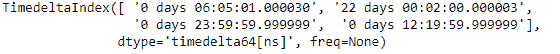
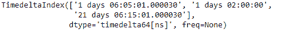

# Python |熊猫时间差指数. dropna

> 哎哎哎:# t0]https://www . geeksforgeeks . org/python 熊猫时间增量索引-dropna/

Python 是进行数据分析的优秀语言，主要是因为以数据为中心的 python 包的奇妙生态系统。 ***【熊猫】*** 就是其中一个包，让导入和分析数据变得容易多了。

熊猫 `**TimedeltaIndex.dropna()**`函数从给定的时间增量索引对象中删除所有丢失的值。函数返回没有`NA/NaN`值的索引。

> **语法:**time delta index . dropna(how = ' any ')
> 
> **参数:**
> **如何:**如果 Index 是 MultiIndex，当任意或所有级别都是 NaN 时，删除该值。
> 
> **返回:**有效:索引

**示例#1:** 使用`TimedeltaIndex.dropna()`函数删除给定时间增量索引对象中所有缺失的值。

```
# importing pandas as pd
import pandas as pd

# Create the TimedeltaIndex object
tidx = pd.TimedeltaIndex(data =['06:05:01.000030', None, '22 day 2 min 3us 10ns',
                                  '+23:59:59.999999', None, '+12:19:59.999999'])

# Print the TimedeltaIndex object
print(tidx)
```

**输出:**


现在我们将使用`TimedeltaIndex.dropna()`函数从 tidx 对象中删除所有丢失的值。

```
# drop all missing values
tidx.dropna()
```

**输出:**

正如我们在输出中看到的，`TimedeltaIndex.dropna()`函数返回了一个新的对象，该对象的所有缺失值都被删除了。

**示例 2:** 使用`TimedeltaIndex.dropna()`函数删除给定时间增量索引对象中所有缺失的值。

```
# importing pandas as pd
import pandas as pd

# Create the TimedeltaIndex object
tidx = pd.TimedeltaIndex(data =[None, '1 days 06:05:01.000030', None, 
                        '1 days 02:00:00', '21 days 06:15:01.000030'])

# Print the TimedeltaIndex object
print(tidx)
```

**输出:**


现在我们将使用`TimedeltaIndex.dropna()`函数从 tidx 对象中删除所有丢失的值。

```
# drop all missing values
tidx.dropna()
```

**输出:**

正如我们在输出中看到的，`TimedeltaIndex.dropna()`函数返回了一个新的对象，该对象的所有缺失值都被删除了。