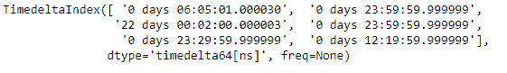
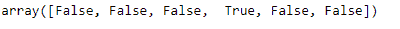
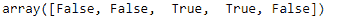

# 蟒蛇|熊猫时间增量索引.重复

> 原文:[https://www . geesforgeks . org/python-pandas-time delta index-replicated/](https://www.geeksforgeeks.org/python-pandas-timedeltaindex-duplicated/)

Python 是进行数据分析的优秀语言，主要是因为以数据为中心的 python 包的奇妙生态系统。 ***【熊猫】*** 就是其中一个包，让导入和分析数据变得容易多了。

熊猫 `**TimedeltaIndex.duplicated()**`函数检测给定时间增量索引对象中的重复值。它返回一个表示重复值的布尔值*。除第一次出现外，所有重复出现的值都标记为`True`。*

> **语法:**时间增量索引。重复(keep='first ')
> 
> **参数:**
> **保留:** { '第一个'，'最后一个'，False}，默认'第一个'
> **- >** 第一个:除第一次出现外，将重复项标记为 True。
> **- >** 最后:除最后一次出现外，将重复项标记为真。
> **- >** 假:将所有重复标记为真。
> 
> **返回:**重复:np.ndarray

**示例#1:** 使用`TimedeltaIndex.duplicated()`函数检查给定时间增量索引对象中所有重复出现的元素。

```py
# importing pandas as pd
import pandas as pd

# Create the TimedeltaIndex object
tidx = pd.TimedeltaIndex(data =['06:05:01.000030', '+23:59:59.999999',
                                '22 day 2 min 3us 10ns', '+23:59:59.999999',
                                '+23:29:59.999999', '+12:19:59.999999'])

# Print the TimedeltaIndex object
print(tidx)
```

**输出:**


现在我们将使用`TimedeltaIndex.duplicated()`功能检查所有重复出现的情况。

```py
# find duplicated elements in tidx
tidx.duplicated()
```

**输出:**

正如我们在输出中看到的，`TimedeltaIndex.duplicated()`函数返回了一个包含 tidx 每个元素的布尔值的数组。如果元素没有被复制，则标记为`True`，否则标记为`False`。

**示例 2:** 使用`TimedeltaIndex.duplicated()`函数检查给定时间增量索引对象中元素的所有重复出现。

```py
# importing pandas as pd
import pandas as pd

# Create the TimedeltaIndex object
tidx = pd.TimedeltaIndex(data =['1 days 02:00:00', '1 days 06:05:01.000030',
                                '1 days 02:00:00', '1 days 02:00:00',
                                '21 days 06:15:01.000030'])

# Print the TimedeltaIndex object
print(tidx)
```

**输出:**


现在我们将使用`TimedeltaIndex.duplicated()`功能检查所有重复出现的情况。

```py
# find duplicated elements in tidx
tidx.duplicated()
```

**输出:**

正如我们在输出中看到的，`TimedeltaIndex.duplicated()`函数返回了一个包含 tidx 每个元素的布尔值的数组。如果元素没有被复制，则标记为`True`，否则标记为`False`。