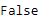

# python \ panda 时标索引. empty

> 原文:[https://www . geesforgeks . org/python-pandas-time deltaindex-empty/](https://www.geeksforgeeks.org/python-pandas-timedeltaindex-empty/)

Python 是进行数据分析的优秀语言，主要是因为以数据为中心的 python 包的奇妙生态系统。 ***【熊猫】*** 就是其中一个包，让导入和分析数据变得容易多了。

熊猫 `**TimedeltaIndex.empty**`属性返回一个布尔值。如果应用它的时间增量索引对象不为空，则返回`False`。

> **语法**时变指数.空
> 
> **返回:**dttype

**示例#1:** 使用`TimedeltaIndex.empty`属性检查给定的时间增量索引对象是否为空。

```
# importing pandas as pd
import pandas as pd

# Create the TimedeltaIndex object
tidx = pd.TimedeltaIndex(data =['1 days 02:00:00', '1 days 06:05:01.000030'])

# Print the TimedeltaIndex
print(tidx)
```

**输出:**

现在我们来检查给定的 TimedeltaIndex 对象是否为空。

```
# check if tidx is empty or not
tidx.empty
```

**输出:**

正如我们在输出中看到的，`TimedeltaIndex.empty`已经返回`False`表示 tidx 对象不是空的。

**示例 2:** 使用`TimedeltaIndex.empty`属性检查给定的时间增量索引对象是否为空。

```
# importing pandas as pd
import pandas as pd

# Create the TimedeltaIndex object
tidx = pd.TimedeltaIndex(data =['-1 days 2 min 3us', '1 days 06:05:01.000030',
                                                  '-1 days + 23:59:59.999999'])

# Print the TimedeltaIndex
print(tidx)
```

**输出:**


现在我们将检查给定的时间增量索引对象是否为空。

```
# check if tidx is empty or not
tidx.empty
```

**输出:**

正如我们在输出中看到的，`TimedeltaIndex.empty`已经返回`False`表示 tidx 对象不是空的。