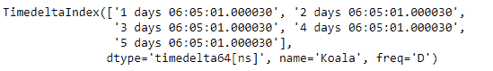
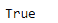
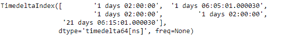
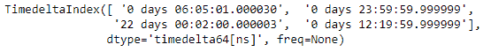
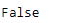

# 蟒蛇|熊猫时间增量索引等于

> 原文:[https://www . geesforgeks . org/python-pandas-time deltaindex-equals/](https://www.geeksforgeeks.org/python-pandas-timedeltaindex-equals/)

Python 是进行数据分析的优秀语言，主要是因为以数据为中心的 python 包的奇妙生态系统。 ***【熊猫】*** 就是其中一个包，让导入和分析数据变得容易多了。

熊猫 `**TimedeltaIndex.equals()**`功能确定两个索引对象是否包含相同的元素。如果考虑的两个对象包含相同的元素，函数返回**真**，否则函数返回**假**。

> **语法:**时间增量索引等于(其他)
> 
> **参数:**
> **等于:**其他对象
> 
> **返回:**布尔值

**示例#1:** 使用`TimedeltaIndex.equals()`函数检查两个给定时间增量索引对象中包含的元素是否相同。

```
# importing pandas as pd
import pandas as pd

# Create the first TimedeltaIndex object
tidx1 = pd.TimedeltaIndex(start ='1 days 06:05:01.000030', periods = 5,
                                             freq ='D', name ='Koala')

# Create the second TimedeltaIndex object
tidx2 = pd.TimedeltaIndex(start ='1 days 06:05:01.000030', periods = 5,
                                             freq ='D', name ='Koala')

# Print the first TimedeltaIndex object
print(tidx1)

# Print the second TimedeltaIndex object
print(tidx2)
```

**输出:**


现在我们使用`TimedeltaIndex.equals()`功能检查 tidx1 和 tidx2 中包含的值是否相同。

```
# find if the elements are equal
# in tidx1 and tidx2
tidx.equals(tidx2)
```

**输出:**

正如我们在输出中看到的，`TimedeltaIndex.equals()`函数已经返回了`True`，表示两个对象具有相同的元素集。

**示例 2:** 使用`TimedeltaIndex.equals()`功能检查两个给定的时间增量索引对象中包含的元素是否相同。

```
# importing pandas as pd
import pandas as pd

# Create the TimedeltaIndex object
tidx1 = pd.TimedeltaIndex(data =['1 days 02:00:00', '1 days 06:05:01.000030', 
                                 '1 days 02:00:00', '1 days 02:00:00',
                                 '21 days 06:15:01.000030'])

# Create the second TimedeltaIndex object
tidx2 = pd.TimedeltaIndex(data =['06:05:01.000030', '+23:59:59.999999', 
                                 '22 day 2 min 3us 10ns', '+12:19:59.999999'])

# Print the first and second TimedeltaIndex object
print(tidx1, "\n", tidx2)
```

**输出:**



现在我们将使用`TimedeltaIndex.equals()`功能来检查 tidx1 和 tidx2 中包含的值是否相同。

```
# find if the elements are equal 
# in tidx1 and tidx2
tidx.equals(tidx2)
```

**输出:**

正如我们在输出中看到的，`TimedeltaIndex.equals()`函数已经返回了`False`表示两个对象没有相同的元素集。