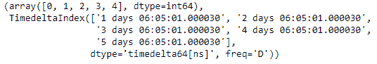
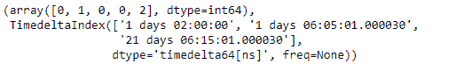

# Python |熊猫时间差指数。系数

> 哎哎哎::1230【https://www . geeksforgeeks . org/python 熊猫时间增量指数系数/

Python 是进行数据分析的优秀语言，主要是因为以数据为中心的 python 包的奇妙生态系统。 ***【熊猫】*** 就是其中一个包，让导入和分析数据变得容易多了。

熊猫 `**TimedeltaIndex.factorize()**`函数将给定时间增量索引对象的元素编码为枚举类型或分类变量。

> **语法:**时间增量索引因子化(排序=假，na_sentinel=-1)
> 
> **参数:**
> **排序:**按值排序
> **na_sentinel :** 值标记“未找到”
> 
> **返回:**标签:原始数组的索引器

**示例#1:** 使用`TimedeltaIndex.factorize()`函数对给定时间增量索引对象的元素进行编码。

```py
# importing pandas as pd
import pandas as pd

# Create the TimedeltaIndex object
tidx = pd.TimedeltaIndex(start ='1 days 06:05:01.000030',
                   periods = 5, freq ='D', name ='Koala')

# Print the TimedeltaIndex object
print(tidx)
```

**输出:**


现在我们将使用`TimedeltaIndex.factorize()`函数对 tidx 对象进行编码。

```py
# encode the tidx object
tidx.factorize()
```

**输出:**


正如我们在输出中看到的那样，`TimedeltaIndex.factorize()`函数已经对 tidx 对象的元素进行了编码。它为每个元素分配了一个唯一的代码。

**示例 2:** 使用`TimedeltaIndex.factorize()`函数检查两个给定时间增量索引对象中包含的元素是否相同。

```py
# importing pandas as pd
import pandas as pd

# Create the TimedeltaIndex object
tidx = pd.TimedeltaIndex(data =['1 days 02:00:00', '1 days 06:05:01.000030',
          '1 days 02:00:00', '1 days 02:00:00', '21 days 06:15:01.000030'])

# Print the TimedeltaIndex object
print(tidx)
```

**输出:**

现在我们使用`TimedeltaIndex.factorize()`功能对 tidx 对象进行编码。

```py
# encode the tidx object
tidx.factorize()
```

**输出:**

正如我们在输出中看到的，`TimedeltaIndex.factorize()`函数已经对 tidx 对象的元素进行了编码。它为每个元素分配了一个唯一的代码。