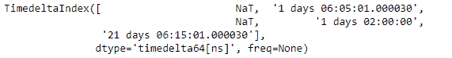
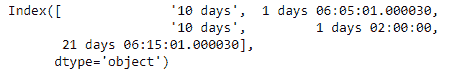
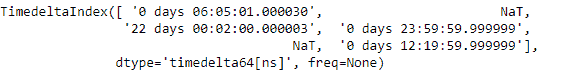
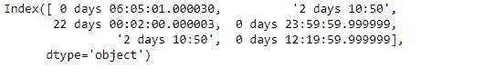

# Python |熊猫时间差指数. fillna

> 哎哎哎:# t0]https://www . geeksforgeeks . org/python-pandas-time delta index-fillna/

Python 是进行数据分析的优秀语言，主要是因为以数据为中心的 python 包的奇妙生态系统。 ***【熊猫】*** 就是其中一个包，让导入和分析数据变得容易多了。

熊猫 `**TimedeltaIndex.fillna()**`函数用指定的值填充给定时间增量索引对象中所有缺失的值。

> **语法:**时间增量索引. fillna(值=无，向下转换=无)
> 
> **参数:**
> **值:**用于填充孔洞的标量值(例如 0)。该值不能是喜欢的列表。
> **向下转换:**项的字典- >如果可能的话要向下转换的数据类型，或者尝试向下转换为适当的相等类型的字符串“推断”(例如，如果可能的话从 float64 到 int64)
> 
> **返回:**填充:%(klass)s

**示例#1:** 使用`TimedeltaIndex.fillna()`函数填充给定时间增量索引对象中所有缺失的值。

```py
# importing pandas as pd
import pandas as pd

# Create the TimedeltaIndex object
tidx = pd.TimedeltaIndex(data =[None, '1 days 06:05:01.000030', None,
                       '1 days 02:00:00', '21 days 06:15:01.000030'])

# Print the TimedeltaIndex object
print(tidx)
```

**输出:**


现在我们将使用`TimedeltaIndex.fillna()`函数来填充 tidx 对象中所有缺失的值。

```py
# fill the missing values
tidx.fillna('10 days')
```

**输出:**


我们可以在输出中看到，`TimedeltaIndex.fillna()`函数已经用 tidx 对象中的指定值填充了所有缺失的值。

**示例 2:** 使用`TimedeltaIndex.fillna()`函数填充给定时间增量索引对象中所有缺失的值。

```py
# importing pandas as pd
import pandas as pd

# Create the TimedeltaIndex object
tidx = pd.TimedeltaIndex(data =['06:05:01.000030', None, '22 day 2 min 3us 10ns',
                                    '+23:59:59.999999', None, '+12:19:59.999999'])

# Print the TimedeltaIndex object
print(tidx)
```

**输出:**


现在我们将使用`TimedeltaIndex.fillna()`函数来填充 tidx 对象中所有缺失的值。

```py
# fill the missing values
tidx.fillna('2 days 10:50')
```

**输出:**

正如我们在输出中看到的，`TimedeltaIndex.fillna()`函数已经用 tidx 对象中的指定值填充了所有缺失的值。