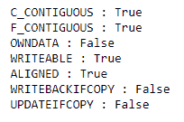

# Python |熊猫时间差指数.标志

> 哎哎哎::1230【https://www . geeksforgeeks . org/python 熊猫时间增量索引标志/

Python 是进行数据分析的优秀语言，主要是因为以数据为中心的 python 包的奇妙生态系统。 ***【熊猫】*** 就是其中一个包，让导入和分析数据变得容易多了。
熊猫**时间增量索引.标志**属性返回给定对象的各种标志的状态。检查它们是否已设置。一些标志的例子有 ALIGNED、WRITE 等。

> **语法:**时间增量索引.标志
> **返回:**标志状态

**示例#1:** 使用时间增量索引.标志属性检查给定时间增量索引对象的各种标志的状态。

## 蟒蛇 3

```
# importing pandas as pd
import pandas as pd

# Create the TimedeltaIndex object
tidx = pd.TimedeltaIndex(data =['1 days 02:00:00', '1 days 06:05:01.000030'])

# Print the TimedeltaIndex
print(tidx)
```

**输出:**


现在我们将检查给定时间增量索引对象的标志状态。

## 蟒蛇 3

```
# return status of flags
tidx.flags
```

**输出:**



正如我们在输出中看到的，TimedeltaIndex.flags 已经返回了标志的状态。对于所有已设置的标志，它返回真；对于未设置的标志，它返回假。

**示例#2:** 使用 TimedeltaIndex.flags 属性检查给定 TimedeltaIndex 对象的各种标志的状态。

## 蟒蛇 3

```
# importing pandas as pd
import pandas as pd

# Create the TimedeltaIndex object
tidx = pd.TimedeltaIndex(data =['-1 days 2 min 3us', '1 days 06:05:01.000030',
                                                 '-1 days + 23:59:59.999999'])

# Print the TimedeltaIndex
print(tidx)
```

**输出:**


现在我们将检查给定时间增量索引对象的标志状态。

## 蟒蛇 3

```
# return status of flags
tidx.flags
```

**输出:**


正如我们在输出中看到的，TimedeltaIndex.flags 已经返回了标志的状态。对于所有已设置的标志，它返回真；对于未设置的标志，它返回假。