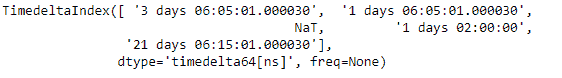
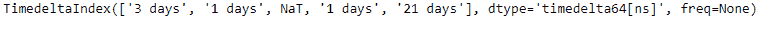
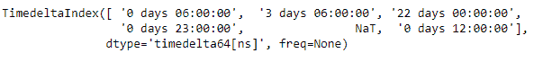

# Python |熊猫时间差指数. floor

> 哎哎哎:# t0]https://www . geeksforgeeks . org/python-pandas-time delta index-floor/

Python 是进行数据分析的优秀语言，主要是因为以数据为中心的 python 包的奇妙生态系统。 ***【熊猫】*** 就是其中一个包，让导入和分析数据变得容易多了。

熊猫 `**TimedeltaIndex.floor()**`函数将给定时间增量索引对象中的所有值转换为指定的频率。

> **语法:**时间增量索引. floor(freq)
> 
> **参数:**
> **freq :** freq 字符串/对象
> 
> **返回:**同类型索引

**示例#1:** 使用`TimedeltaIndex.floor()`功能将给定时间增量索引对象中的所有值计算到每日频率。

```py
# importing pandas as pd
import pandas as pd

# Create the TimedeltaIndex object
tidx = pd.TimedeltaIndex(data =['3 days 06:05:01.000030', '1 days 06:05:01.000030',
                               None, '1 days 02:00:00', '21 days 06:15:01.000030'])

# Print the TimedeltaIndex object
print(tidx)
```

**输出:**


现在我们将使用`TimedeltaIndex.floor()`函数来计算所有的值。

```py
# floor the values to daily frequency
tidx.floor(freq ='D')
```

**输出:**

正如我们在输出中看到的，`TimedeltaIndex.floor()`功能已经将所有值钻到了每日频率。

**示例#2:** 使用`TimedeltaIndex.floor()`功能将给定时间增量索引对象中的所有值计算到每小时频率。

```py
# importing pandas as pd
import pandas as pd

# Create the TimedeltaIndex object
tidx = pd.TimedeltaIndex(data =['06:05:01.000030', '3 days 06:05:01.000030',
                                '22 day 2 min 3us 10ns', '+23:59:59.999999',
                                                  None, '+12:19:59.999999'])

# Print the TimedeltaIndex object
print(tidx)
```

**输出:**


现在我们将使用`TimedeltaIndex.floor()`函数来计算所有的值。

```py
# floor the values to hourly frequency
tidx.floor('H')
```

**输出:**

正如我们在输出中看到的，`TimedeltaIndex.floor()`函数已经将所有值钻到了小时频率。