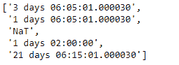
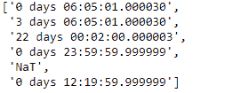

# Python |熊猫时间差指数.格式

> 哎哎哎::1230【https://www . geeksforgeeks . org/python 熊猫时间增量索引格式/

Python 是进行数据分析的优秀语言，主要是因为以数据为中心的 python 包的奇妙生态系统。 ***【熊猫】*** 就是其中一个包，让导入和分析数据变得容易多了。

熊猫 `**TimedeltaIndex.format()**`函数呈现给定时间增量索引对象的字符串表示。

> **语法:**时间增量索引.格式(名称=假，格式化程序=无，**kwargs)
> 
> **参数:**T2**名称:**名称
> 
> **返回:**数组

**示例#1:** 使用`TimedeltaIndex.format()`函数渲染给定时间增量索引对象的字符串表示。

```py
# importing pandas as pd
import pandas as pd

# Create the TimedeltaIndex object
tidx = pd.TimedeltaIndex(data =['3 days 06:05:01.000030', '1 days 06:05:01.000030',
                               None, '1 days 02:00:00', '21 days 06:15:01.000030'])

# Print the TimedeltaIndex object
print(tidx)
```

**输出:**


现在，我们将使用`TimedeltaIndex.format()`函数向给定的对象呈现字符串表示。

```py
# renders string representation to the index
tidx.format()
```

**输出:**

正如我们在输出中看到的，`TimedeltaIndex.format()`函数返回了一个类似数组的对象，该对象包含字符串形式的 tidx 的所有元素。

**示例 2:** 使用`TimedeltaIndex.format()`函数渲染给定时间增量索引对象的字符串表示。

```py
# importing pandas as pd
import pandas as pd

# Create the TimedeltaIndex object
tidx = pd.TimedeltaIndex(data =['06:05:01.000030', '3 days 06:05:01.000030',
                                '22 day 2 min 3us 10ns', '+23:59:59.999999',
                                                  None, '+12:19:59.999999'])

# Print the TimedeltaIndex object
print(tidx)
```

**输出:**

现在我们将使用`TimedeltaIndex.format()`函数为给定的对象渲染一个字符串表示。

```py
# renders string representation to the index
tidx.format()
```

**输出:**

正如我们在输出中看到的，`TimedeltaIndex.format()`函数返回了一个类似数组的对象，其中包含了字符串形式的 tidx 的所有元素。