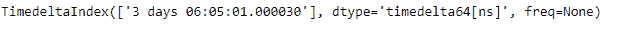
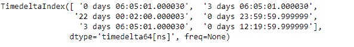
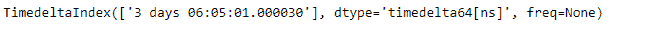

# Python | Pandas time deltaindex . get _ duplicates

> 原文:[https://www . geesforgeks . org/python-pandas-time deltaindex-get _ duplicates/](https://www.geeksforgeeks.org/python-pandas-timedeltaindex-get_duplicates/)

Python 是进行数据分析的优秀语言，主要是因为以数据为中心的 python 包的奇妙生态系统。 ***【熊猫】*** 就是其中一个包，让导入和分析数据变得容易多了。

熊猫 `**TimedeltaIndex.get_duplicates()**`函数返回一个时间增量索引对象，该对象包含给定时间增量索引对象中的所有重复值。

> **语法:**时间增量索引. get_duplicates()
> 
> **参数:**无
> 
> **返回**时标索引对象

**示例#1:** 使用`TimedeltaIndex.get_duplicates()`函数查找给定时间增量索引对象中的所有重复值。

```py
# importing pandas as pd
import pandas as pd

# Create the TimedeltaIndex object
tidx = pd.TimedeltaIndex(data =['3 days 06:05:01.000030', '1 days 06:05:01.000030',
                                '3 days 06:05:01.000030', '1 days 02:00:00',
                                                 '21 days 06:15:01.000030'])

# Print the TimedeltaIndex object
print(tidx)
```

**输出:**


现在我们将使用`TimedeltaIndex.get_duplicates()`函数来查找 tidx 中的所有重复值

```py
# find duplicates
tidx.get_duplicates()
```

**输出:**

正如我们在输出中看到的，`TimedeltaIndex.get_duplicates()`函数返回了一个包含 tidx 中所有重复值的对象。

**示例 2:** 使用`TimedeltaIndex.get_duplicates()`函数查找给定时间增量索引对象中的所有重复值。

```py
# importing pandas as pd
import pandas as pd

# Create the TimedeltaIndex object
tidx = pd.TimedeltaIndex(data =['06:05:01.000030', '3 days 06:05:01.000030',
                                '22 day 2 min 3us 10ns', '+23:59:59.999999',
                              '3 days 06:05:01.000030', '+12:19:59.999999'])

# Print the TimedeltaIndex object
print(tidx)
```

**输出:**

现在我们将使用`TimedeltaIndex.get_duplicates()`函数来查找 tidx 中的所有重复值

```py
# find duplicates
tidx.get_duplicates()
```

**输出:**

正如我们在输出中看到的，`TimedeltaIndex.get_duplicates()`函数返回了一个包含 tidx 中所有重复值的对象。