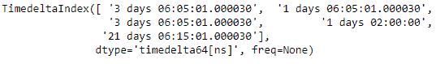
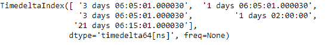
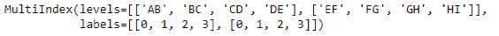
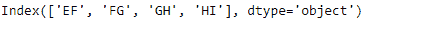

# Python | Pandas time delta index . get _ level _ values

> 原文:[https://www . geesforgeks . org/python-pandas-time deltaindex-get _ level _ values/](https://www.geeksforgeeks.org/python-pandas-timedeltaindex-get_level_values/)

Python 是进行数据分析的优秀语言，主要是因为以数据为中心的 python 包的奇妙生态系统。 ***【熊猫】*** 就是其中一个包，让导入和分析数据变得容易多了。

熊猫 `**TimedeltaIndex.get_level_values()**`函数返回一个请求级别的值索引，等于索引的长度。

> **语法:**时间增量索引. get_level_values(级别)
> 
> **参数:**
> **级别:**级别或者是该级别在 MultiIndex 中的整数位置，或者是该级别的名称。
> 
> **返回:**自我，因为指数只有一个级别。

**示例#1:** 使用`TimedeltaIndex.get_level_values()`函数查找给定时间增量索引对象的第 0 级中存在的所有值。

```
# importing pandas as pd
import pandas as pd

# Create the TimedeltaIndex object
tidx = pd.TimedeltaIndex(data =['3 days 06:05:01.000030', '1 days 06:05:01.000030', 
                                '3 days 06:05:01.000030', '1 days 02:00:00', 
                                                 '21 days 06:15:01.000030'])

# Print the TimedeltaIndex object
print(tidx)
```

**输出:**


现在我们将使用`TimedeltaIndex.get_level_values()`函数来查找第 0 级的所有值

```
# print values in 0th level
tidx.get_level_values(0)
```

**输出:**

正如我们在输出中看到的，`TimedeltaIndex.get_level_values()`函数已经返回了 tidx 对象第 0 级中存在的所有值。此对象只有一个级别。

**示例 2:** 使用`MultiIndex.get_level_values()`函数查找给定多索引对象的第一级中存在的所有值。

```
# importing pandas as pd
import pandas as pd

# Create the MultiIndex object
midx = pd.MultiIndex.from_arrays((['AB', 'BC', 'CD', 'DE'], 
                                  ['EF', 'FG', 'GH', 'HI']))

# Print the MultiIndex object
print(midx)
```

**输出:**


现在我们将使用`MultiIndex.get_level_values()`函数来查找第一级中的所有值

```
# print values in 1st level
midx.get_level_values(1)
```

**输出:**

正如我们在输出中看到的，`MultiIndex.get_level_values()`函数已经返回了 midx 对象第一级中存在的所有值。