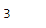
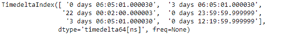

# Python | Pandas 时间增量索引. get_loc

> 哎哎哎:# t0]https://www . geeksforgeeks . org/python-pandas-time delta index-get _ loc/

Python 是进行数据分析的优秀语言，主要是因为以数据为中心的 python 包的奇妙生态系统。 ***【熊猫】*** 就是其中一个包，让导入和分析数据变得容易多了。

熊猫 `**TimedeltaIndex.get_loc()**`函数返回给定时间增量索引对象中请求标签的整数位置。

> **语法:** TimedeltaIndex.get_loc(键，方法=无，容差=无)
> 
> **参数:**
> **键:**值在对象中寻找。
> 
> **返回:**锁定:int

**示例#1:** 使用`TimedeltaIndex.get_loc()`函数查找给定时间增量索引对象中某个值的整数位置。

```
# importing pandas as pd
import pandas as pd

# Create the TimedeltaIndex object
tidx = pd.TimedeltaIndex(data =['3 days 06:05:01.000030', '1 days 06:05:01.000030',
                                '3 days 06:05:01.000030', '1 days 02:00:00', 
                                                 '21 days 06:15:01.000030'])

# Print the TimedeltaIndex object
print(tidx)
```

**输出:**

现在我们将使用`TimedeltaIndex.get_loc()`功能查找‘1 天 02:00:00’的整数位置。

```
# find the integer location of the passed value.
tidx.get_loc('1 days 02:00:00')
```

**输出:**

正如我们在输出中看到的那样，`TimedeltaIndex.get_loc()`函数返回了 3，表示传递的标签出现在给定时间增量索引对象的这个位置。

**示例 2:** 使用`TimedeltaIndex.get_loc()`函数在给定的 TimedeltaIndex 对象中查找一个值的整数位置。

```
# importing pandas as pd
import pandas as pd

# Create the TimedeltaIndex object
tidx = pd.TimedeltaIndex(data =['06:05:01.000030', '3 days 06:05:01.000030',
                                '22 day 2 min 3us 10ns', '+23:59:59.999999',
                             '3 days 06:05:01.000030', '+12:19:59.999999'])

# Print the TimedeltaIndex object
print(tidx)
```

**输出:**


现在我们将使用`TimedeltaIndex.get_loc()`函数来查找“+12:19:59.999999”的整数位置。

```
# find the integer location of the passed value.
tidx.get_loc('+12:19:59.999999')
```

**输出:**

正如我们在输出中看到的，`TimedeltaIndex.get_loc()`函数返回了 5，表示传递的标签出现在给定的 TimedeltaIndex 对象的这个位置。