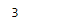

# Python | Pandas time delta index . get _ slice _ bound

> 原文:[https://www . geesforgeks . org/python-pandas-time deltaindex-get _ slice _ bound/](https://www.geeksforgeeks.org/python-pandas-timedeltaindex-get_slice_bound/)

Python 是进行数据分析的优秀语言，主要是因为以数据为中心的 python 包的奇妙生态系统。 ***【熊猫】*** 就是其中一个包，让导入和分析数据变得容易多了。

熊猫 `**TimedeltaIndex.get_slice_bound()**`函数计算对应于给定标签的切片边界。该函数返回给定标签最左边(如果边== '右')的位置。

> **语法:**时间增量索引. get_slice_bound(标签，侧面，种类)
> 
> **参数:**
> **标签:**对象
> **侧:** {【左】、【右】}
> **种类:**{【IX】、【loc】、【getitem】
> 
> **返回:** int

**示例#1:** 使用`TimedeltaIndex.get_slice_bound()`函数在给定的时间增量索引对象中找到一个值的左边界。

```py
# importing pandas as pd
import pandas as pd

# Create the TimedeltaIndex object
tidx = pd.TimedeltaIndex(data =['3 days 06:05:01.000030', '1 days 06:05:01.000030',
                                '3 days 06:05:01.000030', '1 days 02:00:00',
                                                 '21 days 06:15:01.000030'])

# Print the TimedeltaIndex object
print(tidx)
```

**输出:**


现在我们将使用`TimedeltaIndex.get_slice_bound()`函数来查找“1 天 02:00:00”的左侧切片边界。

```py
# find the left slice bound for passed value
tidx.get_slice_bound('1 days 02:00:00', side ='left', kind ='loc')
```

**输出:**

正如我们在输出中看到的，`TimedeltaIndex.get_slice_bound()`函数返回了 3 作为给定时间增量索引对象中传递值的切片边界。

**示例#2:** 使用`TimedeltaIndex.get_slice_bound()`函数在给定的时间增量索引对象中查找值的左切片边界。

```py
# importing pandas as pd
import pandas as pd

# Create the TimedeltaIndex object
tidx = pd.TimedeltaIndex(data =['06:05:01.000030', '3 days 06:05:01.000030', 
                                '22 day 2 min 3us 10ns', '+23:59:59.999999',
                             '13 days 06:05:01.000030', '+12:19:59.999999'])

# Print the TimedeltaIndex object
print(tidx)
```

**输出:**

现在我们使用`TimedeltaIndex.get_slice_bound()`函数找到‘13 天 06:05:01.000030’的左切片边界。

```py
# find the left slice bound for passed value
tidx.get_slice_bound('13 days 06:05:01.000030', side ='left', kind ='loc')
```

**输出:**

正如我们在输出中看到的，`TimedeltaIndex.get_slice_bound()`函数已经返回了 4 作为给定时间增量索引对象中传递值的切片边界。