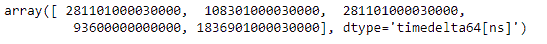
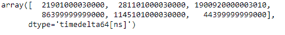

# Python | Pandas time deltaindex . get _ values

> 原文:[https://www . geesforgeks . org/python-pandas-time deltaindex-get _ values/](https://www.geeksforgeeks.org/python-pandas-timedeltaindex-get_values/)

Python 是进行数据分析的优秀语言，主要是因为以数据为中心的 python 包的奇妙生态系统。 ***【熊猫】*** 就是其中一个包，让导入和分析数据变得容易多了。

熊猫 `**TimedeltaIndex.get_values()**`函数返回基础数据作为给定时间增量索引对象的数组。

> **语法:**时间增量索引. get_values()
> 
> **参数:**无
> 
> **返回:**ndaarray

**示例#1:** 使用`TimedeltaIndex.get_values()`函数以数组形式返回给定时间增量索引对象的基础数据。

```py
# importing pandas as pd
import pandas as pd

# Create the TimedeltaIndex object
tidx = pd.TimedeltaIndex(data =['3 days 06:05:01.000030', '1 days 06:05:01.000030', 
                                '3 days 06:05:01.000030', '1 days 02:00:00',
                                                 '21 days 06:15:01.000030'])

# Print the TimedeltaIndex object
print(tidx)
```

**输出:**

现在我们使用`TimedeltaIndex.get_values()`函数返回 tidx 的数据作为数组

```py
# return data as an ndarray
tidx.get_values()
```

**输出:**

正如我们在输出中看到的，`TimedeltaIndex.get_values()`函数已经将 tidx 对象的数据作为一个数组返回。

**示例 2:** 使用`TimedeltaIndex.get_values()`函数返回给定时间增量索引对象的底层数据作为数组。

```py
# importing pandas as pd
import pandas as pd

# Create the TimedeltaIndex object
tidx = pd.TimedeltaIndex(data =['06:05:01.000030', '3 days 06:05:01.000030',
                                '22 day 2 min 3us 10ns', '+23:59:59.999999',
                             '13 days 06:05:01.000030', '+12:19:59.999999'])

# Print the TimedeltaIndex object
print(tidx)
```

**输出:**

现在我们使用`TimedeltaIndex.get_values()`函数返回 tidx 的数据作为数组

```py
# return data as an ndarray
tidx.get_values()
```

**输出:**

正如我们在输出中看到的，`TimedeltaIndex.get_values()`函数已经将 tidx 对象的数据作为一个数组返回。