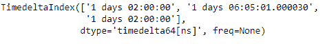
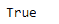
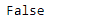

# Python | Pandas time deltaindex . has _ duplicates

> 原文:[https://www . geesforgeks . org/python-pandas-time deltaindex-has _ duplicates/](https://www.geeksforgeeks.org/python-pandas-timedeltaindex-has_duplicates/)

Python 是进行数据分析的优秀语言，主要是因为以数据为中心的 python 包的奇妙生态系统。 ***【熊猫】*** 就是其中一个包，让导入和分析数据变得容易多了。

熊猫 `**TimedeltaIndex.has_duplicates**`属性返回一个布尔值。如果时间增量索引对象包含重复值，则返回`True`，否则返回`False`，表示对象中不存在重复值。

> **语法:**时间增量索引. has_duplicates
> 
> **返回:**布尔值

**示例#1:** 使用`TimedeltaIndex.has_duplicates`属性检查给定的时间增量索引对象中是否存在任何重复值。

```py
# importing pandas as pd
import pandas as pd

# Create the TimedeltaIndex object
tidx = pd.TimedeltaIndex(data =['1 days 02:00:00', '1 days 06:05:01.000030', 
                                                         '1 days 02:00:00'])

# Print the TimedeltaIndex
print(tidx)
```

**输出:**


现在，我们将检查给定的时间增量索引对象中是否存在任何重复值。

```py
# check for duplicates
tidx.has_duplicates
```

**输出:**

正如我们在输出中看到的，`TimedeltaIndex.has_duplicates`属性返回了`True`，表示对象中存在重复值。

**示例 2:** 使用`TimedeltaIndex.has_duplicates`属性检查给定的时间增量索引对象中是否存在重复值。

```py
# importing pandas as pd
import pandas as pd

# Create the TimedeltaIndex object
tidx = pd.TimedeltaIndex(data =['-1 days 2 min 3us', '1 days 06:05:01.000030',
                                                 '-1 days + 23:59:59.999999'])

# Print the TimedeltaIndex
print(tidx)
```

**输出:**


现在，我们将检查给定的时间增量索引对象中是否存在任何重复值。

```py
# check for duplicates
tidx.has_duplicates
```

**输出:**

正如我们在输出中看到的，`TimedeltaIndex.has_duplicates`属性返回了`False`，表示对象中不存在重复值。