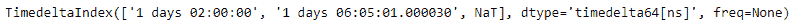
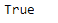

# Python |熊猫时间差指数。hasnans

> 哎哎哎:# t0]https://www . geeksforgeeks . org/python-pandas-time delta index-hasnans/

Python 是进行数据分析的优秀语言，主要是因为以数据为中心的 python 包的奇妙生态系统。 ***【熊猫】*** 就是其中一个包，让导入和分析数据变得容易多了。

熊猫 `**TimedeltaIndex.hasnans**`属性返回一个布尔值。如果时间增量索引对象包含任何`NaN`值，则返回`True`，否则返回`False`，表示对象中不存在`NaN`值。

> **语法:T1】时变指数.相比较**
> 
> **返回:**布尔值

**示例#1:** 使用`TimedeltaIndex.hasnans`属性检查给定的时间增量索引对象中是否存在任何`NaN`值。

```
# importing pandas as pd
import pandas as pd

# Create the TimedeltaIndex object
tidx = pd.TimedeltaIndex(data =['1 days 02:00:00', '1 days 06:05:01.000030', None])

# Print the TimedeltaIndex
print(tidx)
```

**输出:**


现在我们将检查给定的时间增量索引对象中是否存在任何`NaN`值。

```
# check for missing values
tidx.hasnans
```

**输出:**

正如我们在输出中看到的，`TimedeltaIndex.hasnans`属性已经返回`True`表示对象中存在`NaN`值。

**示例 2:** 使用`TimedeltaIndex.hasnans`属性检查给定的时间增量索引对象中是否存在任何`NaN`值。

```
# importing pandas as pd
import pandas as pd

# Create the TimedeltaIndex object
tidx = pd.TimedeltaIndex(data =['-1 days 2 min 3us', '1 days 06:05:01.000030', 
                                                  '-1 days + 23:59:59.999999'])

# Print the TimedeltaIndex
print(tidx)
```

**输出:**


现在我们将检查给定的时间增量索引对象中是否存在任何`NaN`值。

```
# check for missing values
tidx.hasnans
```

**输出:**

正如我们在输出中看到的，`TimedeltaIndex.hasnans`属性已经返回了`False`，表示对象中不存在`NaN`值。