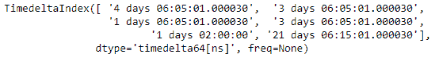
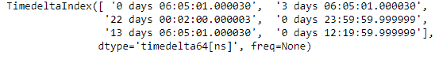
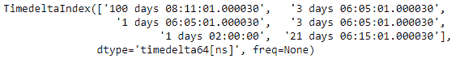

# Python |熊猫时间差指数。插入

> 哎哎哎:# t0]https://www . geeksforgeeks . org/python 熊猫-timedeltaindex-insert/

Python 是进行数据分析的优秀语言，主要是因为以数据为中心的 python 包的奇妙生态系统。 ***【熊猫】*** 就是其中一个包，让导入和分析数据变得容易多了。

熊猫 `**TimedeltaIndex.insert()**`函数返回基础数据作为给定时间增量索引对象的数组。

> **语法:**时间增量索引. insert(loc，item)
> 
> **参数:**
> **loc :** int
> **项:**如果不是 Python 日期时间或类似 numpy 的整数，返回的 Index 数据类型将是对象而不是日期时间。
> 
> **返回:** new_index : Index

**示例#1:** 使用`TimedeltaIndex.insert()`函数在时间增量索引对象中插入新值。它返回一个新对象，新元素被插入到所需的位置。

```
# importing pandas as pd
import pandas as pd

# Create the TimedeltaIndex object
tidx = pd.TimedeltaIndex(data =['3 days 06:05:01.000030', '1 days 06:05:01.000030',
                                '3 days 06:05:01.000030', '1 days 02:00:00',
                                                '21 days 06:15:01.000030'])

# Print the TimedeltaIndex object
print(tidx)
```

**输出:**


现在我们将使用`TimedeltaIndex.insert()`函数在第 0 个位置插入一个值

```
# insert the passed value at 0th position
tidx.insert(loc = 0, item ='4 days 06:05:01.000030')
```

**输出:**

正如我们在输出中看到的，`TimedeltaIndex.insert()`函数已经在 tidx 对象中的期望位置插入了传递的值。

**示例 2:** 使用`TimedeltaIndex.insert()`函数在时间增量索引对象中插入新值。它返回一个新对象，新元素被插入到所需的位置。

```
# importing pandas as pd
import pandas as pd

# Create the TimedeltaIndex object
tidx = pd.TimedeltaIndex(data =['06:05:01.000030', '3 days 06:05:01.000030', 
                                '22 day 2 min 3us 10ns', '+23:59:59.999999', 
                             '13 days 06:05:01.000030', '+12:19:59.999999'])

# Print the TimedeltaIndex object
print(tidx)
```

**输出:**


现在我们将使用`TimedeltaIndex.insert()`函数在第 0 个位置插入一个值

```
# insert the passed value at 0th position
tidx.insert(loc = 0, item ='100 days 08:11:01.000030')
```

**输出:**

正如我们在输出中看到的，`TimedeltaIndex.insert()`函数已经在 tidx 对象中的期望位置插入了传递的值。