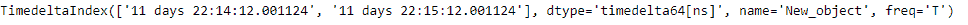
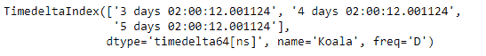

# Python |熊猫时间差指数.交点

> 哎哎哎:# t0]https://www . geeksforgeeks . org/python 熊猫时间增量索引交叉点/

Python 是进行数据分析的优秀语言，主要是因为以数据为中心的 python 包的奇妙生态系统。 ***【熊猫】*** 就是其中一个包，让导入和分析数据变得容易多了。

熊猫**time delta Index . intersection()**函数返回一个新的索引，其中包含两个索引共有的索引元素。这是时间增量索引对象的专用交集。它可能比索引交叉要快得多

> **语法:**时间增量索引.交集(其他)
> **参数:**
> **其他:**时间增量索引或类似数组的
> **返回:**索引或时间增量索引

**示例#1:** 使用 TimedeltaIndex.intersection()函数查找两个 TimedeltaIndex 对象的交集。

## 蟒蛇 3

```
# importing pandas as pd
import pandas as pd

# Create the first TimedeltaIndex object
tidx1 = pd.TimedeltaIndex(start ='11 days 22:11:12.001124', periods = 5,
                                          freq ='T', name ='New_object')

# Create the second TimedeltaIndex object
tidx2 = pd.TimedeltaIndex(start ='11 days 22:14:12.001124', periods = 5,
                                          freq ='T', name ='New_object')

# Print the first and second TimedeltaIndex object
print(tidx1, '\n', tidx2)
```

**输出:**


现在我们将使用 TimedeltaIndex.intersection()函数来查找两个对象的交集

## 蟒蛇 3

```
# find the intersection
tidx1.intersection(tidx2)
```

**输出:**



正如我们在输出中看到的，TimedeltaIndex.intersection()函数返回了一个对象，该对象只包含 tidx1 和 tidx2 共有的元素。

**示例#2:** 使用 TimedeltaIndex.intersection()函数查找两个 TimedeltaIndex 对象的交集。

## 蟒蛇 3

```
# importing pandas as pd
import pandas as pd

# Create the first TimedeltaIndex object
tidx1 = pd.TimedeltaIndex(start ='1 days 02:00:12.001124',
                    periods = 5, freq ='D', name ='Koala')

# Create the second TimedeltaIndex object
tidx2 = pd.TimedeltaIndex(start ='3 days 02:00:12.001124',
                    periods = 5, freq ='D', name ='Koala')

# Print the first and second TimedeltaIndex object
print(tidx1, '\n', tidx2)
```

**输出:**


现在我们将使用 TimedeltaIndex.intersection()函数来查找两个对象的交集

## 蟒蛇 3

```
# find the intersection
tidx1.intersection(tidx2)
```

**输出:**



正如我们在输出中看到的，TimedeltaIndex.intersection()函数返回了一个对象，该对象只包含 tidx1 和 tidx2 共有的元素。