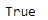

# Python | Pandas time delta index . is _ all _ date

> 原文:[https://www . geesforgeks . org/python-pandas-time deltaindex-is _ all _ date/](https://www.geeksforgeeks.org/python-pandas-timedeltaindex-is_all_dates/)

Python 是进行数据分析的优秀语言，主要是因为以数据为中心的 python 包的奇妙生态系统。 ***【熊猫】*** 就是其中一个包，让导入和分析数据变得容易多了。

熊猫 `**TimedeltaIndex.is_all_dates**`属性返回一个布尔值。如果时间增量索引对象只包含日期，则返回`True`。

> **语法:**时间增量索引. _ all _ dates
> 
> **返回:**布尔值

**示例#1:** 使用`TimedeltaIndex.is_all_dates`属性检查时间增量索引对象是否只包含日期。

```py
# importing pandas as pd
import pandas as pd

# Create the TimedeltaIndex object
tidx = pd.TimedeltaIndex(data =['1 days 02:00:00', 
                   '1 days 06:05:01.000030', None])

# Print the TimedeltaIndex
print(tidx)
```

**输出:**


现在我们将检查时间增量索引对象是否只包含日期。

```py
# check if tidx contains date
tidx.is_all_dates
```

**输出:**

正如我们在输出中看到的，`TimedeltaIndex.is_all_dates`属性已经返回了`True`，表示 tidx 包含所有日期值。

**示例 2:** 使用`TimedeltaIndex.inferred_type`属性检查时间增量索引对象是否只包含日期。

```py
# importing pandas as pd
import pandas as pd

# Create the TimedeltaIndex object
tidx = pd.TimedeltaIndex(data =['-1 days 2 min 3us', '1 days 06:05:01.000030',
                                                 '-1 days + 23:59:59.999999'])

# Print the TimedeltaIndex
print(tidx)
```

**输出:**


现在我们将检查时间增量索引对象是否只包含日期。

```py
# check if tidx contains date
tidx.is_all_dates
```

**输出:**

正如我们在输出中看到的，`TimedeltaIndex.is_all_dates`属性已经返回了`True`，表示 tidx 包含所有日期值。