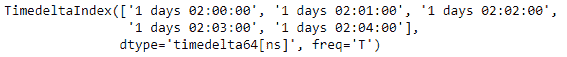

# Python | Pandas time deltaindex . is _ 单调

> 原文:[https://www . geesforgeks . org/python-pandas-time deltaindex-is _ monotonic/](https://www.geeksforgeeks.org/python-pandas-timedeltaindex-is_monotonic/)

Python 是进行数据分析的优秀语言，主要是因为以数据为中心的 python 包的奇妙生态系统。 ***【熊猫】*** 就是其中一个包，让导入和分析数据变得容易多了。

熊猫 `**TimedeltaIndex.is_monotonic**`属性检查给定的时间增量索引对象是否单调。如果对象是单调的，那么函数返回`True`，否则返回`False`。单调意味着对象中的值以这样一种方式变化，它要么从不减少，要么从不增加。

> **语法:**时间增量索引. is _ 单调
> 
> **返回:**布尔值

**示例#1:** 使用`TimedeltaIndex.is_monotonic`属性检查时间增量索引对象是否单调。

```
# importing pandas as pd
import pandas as pd

# Create the TimedeltaIndex object
tidx = pd.TimedeltaIndex(start ='1 days 02:00:00', periods = 5, freq ='T')

# Print the TimedeltaIndex
print(tidx)
```

**输出:**


现在我们将检查时间增量索引对象是否单调。

```
# check if tidx is monotonic or not
tidx.is_monotonic
```

**输出:**

正如我们在输出中看到的，`TimedeltaIndex.is_monotonic`属性已经返回了`True`，表示 tidx 是单调的。

**示例 2:** 使用`TimedeltaIndex.is_monotonic`属性检查时间增量索引对象是否单调。

```
# importing pandas as pd
import pandas as pd

# Create the TimedeltaIndex object
tidx = pd.TimedeltaIndex(data =['-1 days 2 min 3us', '1 days 06:05:01.000030',
                                                 '-1 days + 23:59:59.999999'])

# Print the TimedeltaIndex
print(tidx)
```

**输出:**


现在我们将检查时间增量索引对象是否单调。

```
# check if tidx is monotonic or not
tidx.is_monotonic
```

**输出:**

正如我们在输出中看到的，`TimedeltaIndex.is_monotonic`属性已经返回`False`表示 tidx 不是单调的。