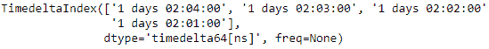
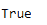
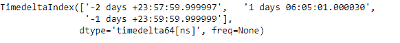
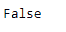

# Python | Pandas time deltaindex . is _ 单调 _ 递减

> 原文:[https://www . geesforgeks . org/python-pandas-time deltaindex-is _ 单调 _ 递减/](https://www.geeksforgeeks.org/python-pandas-timedeltaindex-is_monotonic_decreasing/)

Python 是进行数据分析的优秀语言，主要是因为以数据为中心的 python 包的奇妙生态系统。 ***【熊猫】*** 就是其中一个包，让导入和分析数据变得容易多了。

如果索引值单调递减，熊猫 `**TimedeltaIndex.is_monotonic_decreasing**`属性返回`True`。即使值相等，它也会返回`True`。

> **语法:**时间增量索引 is _ 单调递减
> 
> **返回:**布尔值

**示例#1:** 使用`TimedeltaIndex.is_monotonic_decreasing`属性检查时间增量索引对象是否单调递减。

```py
# importing pandas as pd
import pandas as pd

# Create the TimedeltaIndex object
tidx = pd.TimedeltaIndex(data =['1 days 02:04:00', '1 days 02:03:00', 
                               '1 days 02:02:00', '1 days 02:01:00'])

# Print the TimedeltaIndex
print(tidx)
```

**输出:**

现在我们来检查 TimedeltaIndex 对象是否单调递减。

```py
# check if tidx is monotonic decreasing or not
tidx.is_monotonic_decreasing
```

**输出:**

正如我们在输出中所看到的，`TimedeltaIndex.is_monotonic_decreasing`属性已经返回了`True`，表示 tidx 对象中的值是单调递减的。

**示例 2:** 使用`TimedeltaIndex.is_monotonic_decreasing`属性检查时间增量索引对象是否单调递减。

```py
# importing pandas as pd
import pandas as pd

# Create the TimedeltaIndex object
tidx = pd.TimedeltaIndex(data =['-1 days 2 min 3us', '1 days 06:05:01.000030',
                                                 '-1 days + 23:59:59.999999'])

# Print the TimedeltaIndex
print(tidx)
```

**输出:**


现在我们将检查时间增量索引对象是否单调递减。

```py
# check if tidx is monotonic decreasing or not
tidx.is_monotonic_decreasing
```

**输出:**

正如我们在输出中看到的，`TimedeltaIndex.is_monotonic_decreasing`属性已经返回`False`，表明 tidx 对象中的值不是单调递减的。