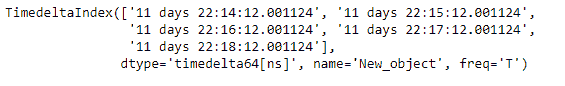
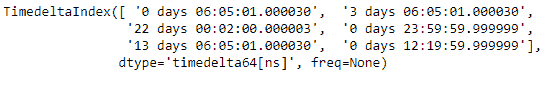

# Python |熊猫时间差指数。isin

> 哎哎哎:# t0]https://www . geeksforgeeks . org/python-pandas-time delta index-isin/

Python 是进行数据分析的优秀语言，主要是因为以数据为中心的 python 包的奇妙生态系统。 ***【熊猫】*** 就是其中一个包，让导入和分析数据变得容易多了。

熊猫 `**TimedeltaIndex.isin()**`函数计算一个布尔数组，该数组表示每个索引值是否在传递的值集中找到。如果在传递的值中找到索引值，则标记为`True`，否则标记为`False`。

> **语法:**时间增量索引. isin(值)
> 
> **参数:**
> **值:**集合或序列值
> 
> **返回:** is_contained : ndarray(布尔数据类型)

**示例#1:** 使用`TimedeltaIndex.isin()`函数检查给定时间增量索引对象的元素是否存在于传递的值列表中。

```py
# importing pandas as pd
import pandas as pd

# Create the TimedeltaIndex object
tidx = pd.TimedeltaIndex(start ='11 days 22:14:12.001124',
               periods = 5, freq ='T', name ='New_object')

# Print the TimedeltaIndex object
print(tidx)
```

**输出:**

现在我们使用`TimedeltaIndex.isin()`函数来查找索引标签是否存在于传递的列表中。

```py
# check if labels are present in the passed list
tidx.isin(['11 days 22:16:12.001124', '11 days 22:17:12.001124'])
```

**输出:**


正如我们在输出中看到的那样，`TimedeltaIndex.isin()`函数返回了一个布尔值数组对象。对象包含与传递列表中存在的元素相对应的`True`值和传递列表中不存在的元素的`False`值。

**示例#2:** 使用`TimedeltaIndex.isin()`函数检查给定时间增量索引对象的元素是否存在于传递的值列表中。

```py
# importing pandas as pd
import pandas as pd

# Create the TimedeltaIndex object
tidx = pd.TimedeltaIndex(data =['06:05:01.000030', '3 days 06:05:01.000030', 
                                '22 day 2 min 3us 10ns', '+23:59:59.999999',
                             '13 days 06:05:01.000030', '+12:19:59.999999'])

# Print the TimedeltaIndex object
print(tidx)
```

**输出:**


现在我们将使用`TimedeltaIndex.isin()`函数来查找索引标签是否存在于传递的列表中。

```py
# check if labels are present in the passed list
tidx.isin(['0 days 23:59:59.999999', '13 days 06:05:01.000030'])
```

**输出:**

正如我们在输出中看到的，`TimedeltaIndex.isin()`函数已经返回了一个布尔值的数组对象。对象包含与传递列表中存在的元素相对应的`True`值和传递列表中不存在的元素的`False`值。