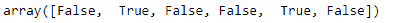

# python \ panda 时标索引. isnull

> 哎哎哎:# t0]https://www . geeksforgeeks . org/python-pandas-time delta index-is null/

Python 是进行数据分析的优秀语言，主要是因为以数据为中心的 python 包的奇妙生态系统。 ***【熊猫】*** 就是其中一个包，让导入和分析数据变得容易多了。

熊猫 `**TimedeltaIndex.isnull()**`函数检测给定时间增量索引对象中所有丢失的值。功能类似`TimedeltaIndex.isna()`。

> **语法:**timedeletendex . isnull()
> 
> **参数:**无
> 
> **返回:**一个布尔数组，表示值是否为 NA

**示例#1:** 使用`TimedeltaIndex.isnull()`函数检测给定时间增量索引对象中的所有缺失值。

```
# importing pandas as pd
import pandas as pd

# Create the TimedeltaIndex object
tidx = pd.TimedeltaIndex(data =['06:05:01.000030', None, '22 day 2 min 3us 10ns', 
                                  '+23:59:59.999999', None, '+12:19:59.999999'])

# Print the TimedeltaIndex object
print(tidx)
```

**输出:**

现在我们将使用`TimedeltaIndex.isnull()`功能检测 tidx 对象中所有缺失的值。

```
# detect all missing values
tidx.isnull()
```

**输出:**

正如我们在输出中看到的，`TimedeltaIndex.isnull()`函数返回了一个数组对象，其中包含与缺失值相对应的`True`值。

**示例 2:** 使用`TimedeltaIndex.isnull()`函数检测给定时间增量索引对象中的所有缺失值。

```
# importing pandas as pd
import pandas as pd

# Create the TimedeltaIndex object
tidx = pd.TimedeltaIndex(data =[None, '1 days 06:05:01.000030', None,
                       '1 days 02:00:00', '21 days 06:15:01.000030'])

# Print the TimedeltaIndex object
print(tidx)
```

**输出:**

现在我们将使用`TimedeltaIndex.isnull()`功能检测 tidx 对象中所有缺失的值。

```
# find all missing values
tidx.isnull()
```

**输出:**

正如我们在输出中看到的，`TimedeltaIndex.isnull()`函数返回了一个数组对象，其中包含与缺失值相对应的`True`值。