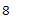
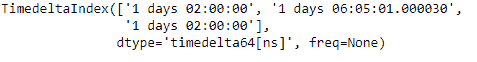

# Python |熊猫时间差指数. itemsize

> 哎哎哎:# t0]https://www . geeksforgeeks . org/python 熊猫-timedeltaindex-itemsize/

Python 是进行数据分析的优秀语言，主要是因为以数据为中心的 python 包的奇妙生态系统。 ***【熊猫】*** 就是其中一个包，让导入和分析数据变得容易多了。

Pandas `**TimedeltaIndex.itemsize**`属性返回底层数据项的数据类型的大小。

> **语法:t1】timedeletendex . item ize**
> 
> **返回:**数据类型的大小

**示例#1:** 使用`TimedeltaIndex.itemsize`属性找出 TimedeltaIndex 对象中底层数据的数据类型大小。

```
# importing pandas as pd
import pandas as pd

# Create the TimedeltaIndex object
tidx = pd.TimedeltaIndex(start ='1 days 02:00:00', periods = 5, freq ='T')

# Print the TimedeltaIndex
print(tidx)
```

**输出:**


现在我们将找出底层数据的数据类型的大小。

```
# find the size of the dtype of the underlying data
tidx.itemsize
```

**输出:**

正如我们在输出中看到的，`TimedeltaIndex.itemsize`属性返回了“8”，它是“timedelta64[ns]”数据类型的大小。

**例 2:** 使用`TimedeltaIndex.itemsize`属性找出 TimedeltaIndex 对象中底层数据的数据类型大小。

```
# importing pandas as pd
import pandas as pd

# Create the TimedeltaIndex object
tidx = pd.TimedeltaIndex(data =['1 days 02:00:00', '1 days 06:05:01.000030',
                                                        '1 days 02:00:00'])

# Print the TimedeltaIndex
print(tidx)
```

**输出:**


现在我们将找出底层数据的数据类型的大小。

```
# find the size of the dtype of the underlying data
tidx.itemsize
```

**输出:**

正如我们在输出中看到的，`TimedeltaIndex.itemsize`属性返回了“8”，它是“timedelta64[ns]”数据类型的大小。